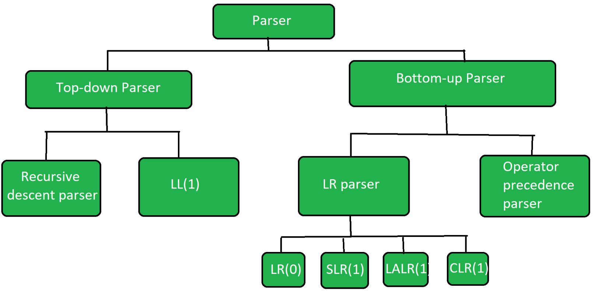

== compiler design
:stem: latexmath

* https://www.tutorialspoint.com/compiler_design/index.htm[tutorial point]
* https://www.geeksforgeeks.org/introduction-of-compiler-design/[gfg]
* https://www.javatpoint.com/compiler-tutorial[jp]
* https://www.youtube.com/watch?v=7Nb-NTGbe-Q&list=PLbRMhDVUMngcseCW7wXDvtTDemCuH80fP&index=3[nptl videos]

=== introduction

* compilers for c
  ** gcc
  ** llvm
* lexical parsers
  ** https://en.wikipedia.org/wiki/GNU_Bison[bison]
    *** uses BNF notation (a context free language)
  ** yacc - yet another compiler compiler
  ** lex - used for lexical analysis
  ** flex - another version of the lex tool, which is open source

=== compile vs interpreters

==== compiler

* scans the entire program and translates the entire program into target
code
* take time to analyze the source code - overall execution is faster
than interpreters
* generate the intermediate object code which require further linking -
hence more memory
* debugging is hard
* e.g. - c cpp c#

==== interpreters

* line by line execution
* less time to analyze the source code - overall execution time is more
than compilers
* no intermediate code is generates - so less memory needed
* better error diagnostics
* e.g. - javascript, python,

=== compiler generate three types of code

* pure machine code -
** for embedded applications
** doesn’t assume existence of any machine code
* {blank}

=== phases of compiler

=== Lexical analysis

=== Passes of Compiler

=== Passes of GCC

=== Compiler Construction Tools

=== Parsing

=== Types of Parsing

=== Recursive Descent Parsing

=== Predictive Parsing

=== Calculation of First

=== Calculation of Follow

== compiler

* read a program in one language, source language
* and translate it into another language, target language

== interpreter

* directly executers the operations specified in the source file and on
given data

== structure of compiler

* lexical analyzer
* syntax analyzer
* semantic analyzer
* intermediate code generation
* machine independent code optimizer
* code generator
* machine dependent code optimizer

[source,mermaid]
----
flowchart TB
    _("Character Stream") -->A["Lexical Analyzer"]
    A -- "Token Stream" -->B["Syntax Analyzer"]
    B -- "Syntax Tree" -->C["Semantic Analyzer"]
    C -- "Syntax Tree" --> D["Intermediate Code Generation"]
    D -- "Intermediate Representation" -->E["Machine Independent Code Generation"]
    E -- "Intermediate Representation" -->F["Code Generator"]
    F -- "Target Machine Code" -->G["Machine Independent Code Optimizer"]
    G --> H("Target Machine Code")
----

== Lexical analyzer

image:img/lexer.png[image]

== Parser

=== top down parser

* generates parse tree for given input string with help of grammar
productions by expanding non-terminals
* it start at start symbol and end at terminals
* uses left most derivation
* recursive decent parser - use backtracking
* non recursive decent parser - `LL(1)` - use parsing table (`first()`,
`follow()`)

=== bottom up parser

* generates the parse tree for given input string with help of grammar
productions by compressing non-terminals
* starts on non-terminals and end at start symbol
* uses reverse of right most derivation

* LR - generates parse tree by using some unambiguous grammar.
* operator precedence parser - two consecutive non-terminals and epsilon
never appear on right side of production

== parsing

=== `first()`

latexmath:[$\text{first}(A)$] contains all terminals present in first
place of every string derived by latexmath:[$A$]

* latexmath:[$X \rightarrow abc$]
** latexmath:[$\text{first}(X) = \text{first}(a) = \{a\}$]
* latexmath:[$X \rightarrow \epsilon$]
** latexmath:[$\text{first}(X) = \{\epsilon\}$]
* latexmath:[$X \rightarrow A$], latexmath:[$A \rightarrow m$]
** latexmath:[$\text{first}(X) = \text{first}(A) = \{m\}$]

=== `follow()`

latexmath:[$\text{follow}(A)$] contains set of all terminals present
immediate to right of latexmath:[$A$]

* latexmath:[$\text{follow}(A)$] never contains latexmath:[$\epsilon$]
* latexmath:[$\text{follow}(S) = \{\$\}$], follow of start symbol
* latexmath:[$X \rightarrow ABC$],
** latexmath:[$\text{follow}(B) = \text{first}(C)$]
** latexmath:[$\text{follow}(C) = \text{follow}(X)$]

* latexmath:[$\text{follow}(S) = \{\$\}$], follow of start symbol
* latexmath:[$X \rightarrow \alpha B \beta$]
** latexmath:[$\text{follow}(B) = \text{first}(\beta)$]
** latexmath:[$\text{follow}(B) = \text{first}(\beta) - \{\epsilon\} \cup \text{follow}(\beta)$],
if latexmath:[$\epsilon \in \text{first}(\beta)$]
* latexmath:[$X \rightarrow \alpha B$]
** latexmath:[$\text{follow}(B) = \text{follow}(X)$]

=== left recursion

* if grammar contains production of form
+
[latexmath]
++++
\[A \rightarrow A \alpha | \beta\]
++++
* it it left recursive grammar
* to remove left recursion
* Convert
+
[latexmath]
++++
\[A \rightarrow A \alpha | \beta\]
++++
to
+
[latexmath]
++++
\[
A \rightarrow \beta A' \\
A' \rightarrow \alpha A' | \epsilon
\]
++++

=== left factoring

* if grammar contains production in form
+
[latexmath]
++++
\[A \rightarrow \alpha \beta_1 | \alpha \beta_2 | ... | \alpha \beta_n\]
++++
* to eliminate it, write it in the form
+
[latexmath]
++++
\[
A \rightarrow A' \\
A' \rightarrow \beta_1 | \beta_2 | ... | \beta_n
\]
++++

== LL(1)

* find *first* and *follow* sets of the grammar given
* create paring table, add dollar with terminal
* now for production
** latexmath:[$A \rightarrow \text{RHS}$], fill it in
latexmath:[$(A, \text{first}(\text{RHS}))$]
** latexmath:[$A \rightarrow abc$], fill it in
latexmath:[$(A, \text{first}(abc))$]
** if latexmath:[$A \rightarrow \epsilon$], fill it in
latexmath:[$(A, \text{follow}(A))$]

Grammar

* latexmath:[$1$] latexmath:[$S \rightarrow (L)$]
* latexmath:[$2$] latexmath:[$S \rightarrow a$]
* latexmath:[$3$] latexmath:[$L \rightarrow SL'$]
* latexmath:[$4$] latexmath:[$L' \rightarrow \epsilon$]
* latexmath:[$5$] latexmath:[$L' \rightarrow ,SL'$]

[cols=",,",options="header",]
|===
|_ |`first` |`follow`
|latexmath:[$S$] |latexmath:[$($] latexmath:[$a$] |$ latexmath:[$)$]

|latexmath:[$L$] |latexmath:[$($] latexmath:[$a$] |latexmath:[$)$]

|latexmath:[$L'$] |latexmath:[$,$] latexmath:[$\epsilon$]
|latexmath:[$)$]
|===

* latexmath:[$S \rightarrow (L)$]
** latexmath:[$S$] and latexmath:[$($]
* latexmath:[$S \rightarrow a$]
** latexmath:[$S$] and latexmath:[$a$]
* latexmath:[$L \rightarrow SL'$]
** latexmath:[$L$] and firstlatexmath:[$(S)$]
** latexmath:[$L$] and latexmath:[$($]
** latexmath:[$L$] and latexmath:[$a$]
* latexmath:[$L' \rightarrow \epsilon$]
** latexmath:[$L'$] and followlatexmath:[$(L')$], because of
latexmath:[$\epsilon$]
** latexmath:[$L'$] and latexmath:[$)$]
* latexmath:[$L' \rightarrow ,SL'$]
** latexmath:[$L'$] and latexmath:[$,$]

[cols=",,,,,",options="header",]
|===
|_ |( |) |a |, |$
|latexmath:[$S$] |1 | |2 | |
|latexmath:[$L$] |3 | |3 | |
|latexmath:[$L'$] | |4 | |5 |
|===

=== how to parse string in `LL(1)`

[source,cpp]
----
bool ll_1_parser(string s, string[][] parsing_table){
  stack<char> st;
  st.push('$'); // default

  int i = 0; // look ahead symbol
  while(i < s.length()){
    char tos = st.top(); // top os stack
    st.pop();

    stack.push(reverse(parsing_table[tos][s[i]]));
    if(isTerminal(st.top())){
      if(st.top() == s[i]){
        i++; // move look ahead on matching
      }
    }
  }

  if(st.empty()) return true; // string accepted
  else return false; // string not accepted
}
----
