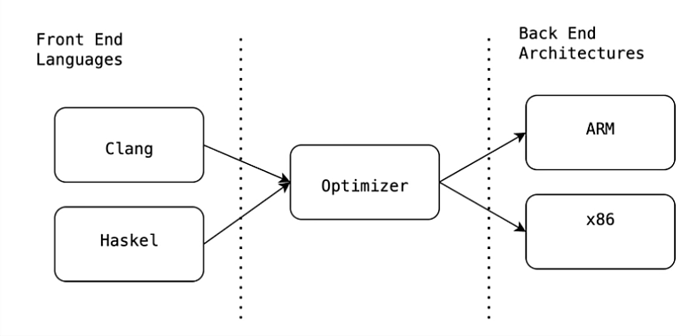

= LLVM vs GCC

- https://llvm.org/[LLVM Project Link]
- https://gcc.gnu.org/[GCC Project Link]
- https://www.youtube.com/watch?v=jg_HTi0gLPM[Video Comparison between LLVM and GCC]

.Comparison between LLVM and GCC
[cols="1,1"]
|===
|LLVM | GCC

|LLVM is modular
|GCC is more tightly coupled, having monolithic reliability.

|
|image:img/gcc-arch.png[GCC Architecture]

| Frontend converts `source code` into `intermediate representation IR` (which is a universal machine agnostic form)
| Here the frontend converts the code form AST to Gimble. RTL - Register Transfer Language is more related to hardware.

| Since it is modular once you target a particular hardware, it will work for all other compilers that use LLVM backend. Like LLVM supports *WebAssembly* and *RISC V*.
| It has more reliability with older architecture, like x86 and more optimized for faster compilation.

|
|

|Much more to be adopted by proprietary because they don't need to share modification back.
|GCC has GPL, so modifications must be shared back.
|=== 