# OpenCourseWare Courses

---

## Introduction to Computer Science and Programming

- **ID**: 6.00
- **Scope**: Undergraduate
- **Title**: Introduction to Computer Science and Programming
- **Link**: <https://ocw.mit.edu/courses/6-00-introduction-to-computer-science-and-programming-fall-2008/>
- **Professors**: 
	- Prof. Eric Grimson
	- Prof. John Guttag
- **Topics**: 
	- Engineering
	- Computer Science
	- Programming Languages
- 

---

## Introduction to Computer Science and Programming in Python

- **ID**: 6.0001
- **Scope**: Undergraduate
- **Title**: Introduction to Computer Science and Programming in Python
- **Link**: <https://ocw.mit.edu/courses/6-0001-introduction-to-computer-science-and-programming-in-python-fall-2016/>
- **Professors**: 
	- Prof. Eric Grimson
	- Prof. John Guttag
- **Topics**: 
	- Engineering
	- Computer Science
	- Programming Languages
- 

---

## Introduction to Computational Thinking and Data Science

- **ID**: 6.0002
- **Scope**: Undergraduate
- **Title**: Introduction to Computational Thinking and Data Science
- **Link**: <https://ocw.mit.edu/courses/6-0002-introduction-to-computational-thinking-and-data-science-fall-2016/>
- **Professors**: 
	- Prof. Eric Grimson
	- Prof. John Guttag
- **Topics**: 
	- Engineering
	- Computer Science
	- Mathematics
- 

---

## Structure and Interpretation of Computer Programs

- **ID**: 6.001
- **Scope**: Undergraduate
- **Title**: Structure and Interpretation of Computer Programs
- **Link**: <https://ocw.mit.edu/courses/6-001-structure-and-interpretation-of-computer-programs-spring-2005/>
- **Professors**: 
	- Prof. Trevor Darrell
	- Prof. Eric Grimson
	- Prof. Peter Szolovits
- **Topics**: 
	- Engineering
	- Computer Science
	- Mathematics
- 

---

## Circuits and Electronics

- **ID**: 6.002
- **Scope**: Undergraduate
- **Title**: Circuits and Electronics
- **Link**: <https://ocw.mit.edu/courses/6-002-circuits-and-electronics-spring-2007/>
- **Professors**: 
	- Prof. Anant Agarwal
- **Topics**: 
	- Engineering
	- Electronics
	- Electrical Engineering
- 

---

## Signals and Systems

- **ID**: 6.003
- **Scope**: Undergraduate
- **Title**: Signals and Systems
- **Link**: <https://ocw.mit.edu/courses/6-003-signals-and-systems-fall-2011/>
- **Professors**: 
	- Prof. Dennis Freeman
- **Topics**: 
	- Engineering
	- Electrical Engineering
	- Signal Processing
- 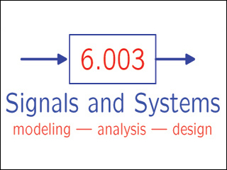

---

## Computation Structures

- **ID**: 6.004
- **Scope**: Undergraduate
- **Title**: Computation Structures
- **Link**: <https://ocw.mit.edu/courses/6-004-computation-structures-spring-2009/>
- **Professors**: 
	- Prof. Steve Ward
- **Topics**: 
	- Engineering
	- Computer Science
	- Mathematics
- 

---

## Computation Structures

- **ID**: 6.004
- **Scope**: Undergraduate
- **Title**: Computation Structures
- **Link**: <https://ocw.mit.edu/courses/6-004-computation-structures-spring-2017/>
- **Topics**: 
	- Engineering
	- Computer Science
	- Electrical Engineering
- 

---

## Elements of Software Construction

- **ID**: 6.005
- **Scope**: Undergraduate
- **Title**: Elements of Software Construction
- **Link**: <https://ocw.mit.edu/courses/6-005-elements-of-software-construction-fall-2008/>
- **Professors**: 
	- Prof. Daniel Jackson
	- Prof. Robert Miller
- **Topics**: 
	- Engineering
	- Computer Science
	- Software Design and Engineering
- 

---

## Software Construction

- **ID**: 6.005
- **Scope**: Undergraduate
- **Title**: Software Construction
- **Link**: <https://ocw.mit.edu/courses/6-005-software-construction-spring-2016/>
- **Professors**: 
	- Prof. Robert Miller
- **Topics**: 
	- Engineering
	- Computer Science
	- Software Design and Engineering
- 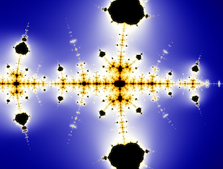

---

## Introduction to Algorithms

- **ID**: 6.006
- **Scope**: Undergraduate
- **Title**: Introduction to Algorithms
- **Link**: <https://ocw.mit.edu/courses/6-006-introduction-to-algorithms-spring-2020/>
- **Professors**: 
	- Prof. Erik Demaine
	- Prof. Justin Solomon
- **Topics**: 
	- Engineering
	- Computer Science
	- Mathematics
- 

---

## Introduction to Algorithms

- **ID**: 6.006
- **Scope**: Undergraduate
- **Title**: Introduction to Algorithms
- **Link**: <https://ocw.mit.edu/courses/6-006-introduction-to-algorithms-spring-2008/>
- **Professors**: 
	- Prof. Erik Demaine
	- Prof. Srini Devadas
	- Prof. Ronald Rivest
- **Topics**: 
	- Engineering
	- Computer Science
	- Mathematics
- 

---

## Introduction to Algorithms

- **ID**: 6.006
- **Scope**: Undergraduate
- **Title**: Introduction to Algorithms
- **Link**: <https://ocw.mit.edu/courses/6-006-introduction-to-algorithms-fall-2011/>
- **Professors**: 
	- Prof. Erik Demaine
	- Prof. Srini Devadas
- **Topics**: 
	- Engineering
	- Computer Science
	- Algorithms and Data Structures
- 

---

## Electromagnetic Energy: From Motors to Lasers

- **ID**: 6.007
- **Scope**: Undergraduate
- **Title**: Electromagnetic Energy: From Motors to Lasers
- **Link**: <https://ocw.mit.edu/courses/6-007-electromagnetic-energy-from-motors-to-lasers-spring-2011/>
- **Professors**: 
	- Prof. Vladimir Bulovic
	- Prof. Jeffrey H. Lang
- **Topics**: 
	- Engineering
	- Science
	- Physics
- 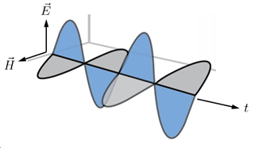

---

## Introduction to Computer Science and Programming

- **ID**: 6.00SC
- **Scope**: Undergraduate
- **Title**: Introduction to Computer Science and Programming
- **Link**: <https://ocw.mit.edu/courses/6-00sc-introduction-to-computer-science-and-programming-spring-2011/>
- **Professors**: 
	- Prof. John Guttag
- **Topics**: 
	- Engineering
	- Computer Science
- 

---

## Signals, Systems and Inference

- **ID**: 6.011
- **Scope**: Undergraduate
- **Title**: Signals, Systems and Inference
- **Link**: <https://ocw.mit.edu/courses/6-011-signals-systems-and-inference-spring-2018/>
- **Professors**: 
	- Prof. Peter Hagelstein
	- Prof. Alan V. Oppenheim
	- Prof. George Verghese
- **Topics**: 
	- Engineering
	- Electrical Engineering
	- Signal Processing
- 

---

## Introduction to Communication, Control, and Signal Processing

- **ID**: 6.011
- **Scope**: Undergraduate
- **Title**: Introduction to Communication, Control, and Signal Processing
- **Link**: <https://ocw.mit.edu/courses/6-011-introduction-to-communication-control-and-signal-processing-spring-2010/>
- **Professors**: 
	- Prof. Alan V. Oppenheim
	- Prof. George Verghese
- **Topics**: 
	- Engineering
	- Electrical Engineering
	- Signal Processing
- 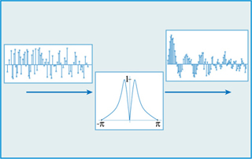

---

## Microelectronic Devices and Circuits

- **ID**: 6.012
- **Scope**: Undergraduate
- **Title**: Microelectronic Devices and Circuits
- **Link**: <https://ocw.mit.edu/courses/6-012-microelectronic-devices-and-circuits-fall-2009/>
- **Professors**: 
	- Prof. Clifton Fonstad
- **Topics**: 
	- Engineering
	- Computer Science
	- Electronics
- 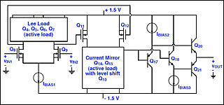

---

## Microelectronic Devices and Circuits

- **ID**: 6.012
- **Scope**: Undergraduate
- **Title**: Microelectronic Devices and Circuits
- **Link**: <https://ocw.mit.edu/courses/6-012-microelectronic-devices-and-circuits-fall-2005/>
- **Professors**: 
	- Prof. Jesús del Alamo
- **Topics**: 
	- Engineering
	- Computer Science
	- Electronics
- 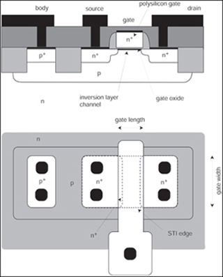

---

## Microelectronic Devices and Circuits

- **ID**: 6.012
- **Scope**: Undergraduate
- **Title**: Microelectronic Devices and Circuits
- **Link**: <https://ocw.mit.edu/courses/6-012-microelectronic-devices-and-circuits-spring-2009/>
- **Professors**: 
	- Prof. Akintunde Akinwande
	- Prof. Jesús del Alamo
	- Prof. Judy Hoyt
- **Topics**: 
	- Engineering
	- Computer Science
	- Electronics
- 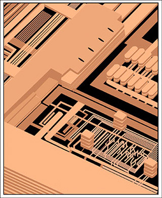

---

## Electromagnetics and Applications

- **ID**: 6.013
- **Scope**: Undergraduate
- **Title**: Electromagnetics and Applications
- **Link**: <https://ocw.mit.edu/courses/6-013-electromagnetics-and-applications-fall-2005/>
- **Professors**: 
	- Prof. Erich Ippen
	- Prof. David Staelin
- **Topics**: 
	- Engineering
	- Science
	- Physics
- 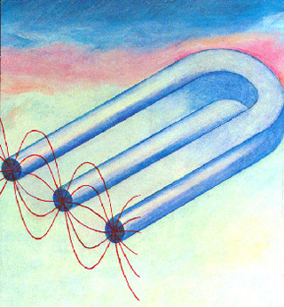

---

## Electromagnetics and Applications

- **ID**: 6.013
- **Scope**: Undergraduate
- **Title**: Electromagnetics and Applications
- **Link**: <https://ocw.mit.edu/courses/6-013-electromagnetics-and-applications-spring-2009/>
- **Professors**: 
	- Prof. David Staelin
- **Topics**: 
	- Engineering
	- Science
	- Physics
- 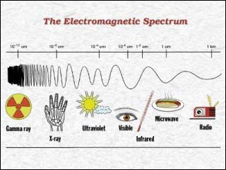

---

## Introduction to Electrical Engineering and Computer Science I

- **ID**: 6.01SC
- **Scope**: Undergraduate
- **Title**: Introduction to Electrical Engineering and Computer Science I
- **Link**: <https://ocw.mit.edu/courses/6-01sc-introduction-to-electrical-engineering-and-computer-science-i-spring-2011/>
- **Professors**: 
	- Prof. Harold Abelson
	- Prof. Isaac Chuang
	- Prof. Dennis Freeman
- **Topics**: 
	- Engineering
	- Computer Science
	- Artificial Intelligence
- 

---

## Introduction to EECS II: Digital Communication Systems

- **ID**: 6.02
- **Scope**: Undergraduate
- **Title**: Introduction to EECS II: Digital Communication Systems
- **Link**: <https://ocw.mit.edu/courses/6-02-introduction-to-eecs-ii-digital-communication-systems-fall-2012/>
- **Professors**: 
	- Prof. Hari Balakrishnan
	- Prof. George Verghese
- **Topics**: 
	- Engineering
	- Computer Science
	- Electrical Engineering
- 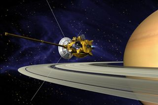

---

## Quantitative Physiology: Cells and Tissues

- **ID**: 6.021J
- **Scope**: Undergraduate
- **Title**: Quantitative Physiology: Cells and Tissues
- **Link**: <https://ocw.mit.edu/courses/6-021j-quantitative-physiology-cells-and-tissues-fall-2004/>
- **Professors**: 
	- Prof. Dennis Freeman
- **Topics**: 
	- Science
	- Health and Medicine
	- Anatomy and Physiology
- 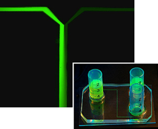

---

## Computer System Engineering

- **ID**: 6.033
- **Scope**: Undergraduate
- **Title**: Computer System Engineering
- **Link**: <https://ocw.mit.edu/courses/6-033-computer-system-engineering-spring-2018/>
- **Topics**: 
	- Engineering
	- Computer Science
	- Software Design and Engineering
- 

---

## Artificial Intelligence

- **ID**: 6.034
- **Scope**: Undergraduate
- **Title**: Artificial Intelligence
- **Link**: <https://ocw.mit.edu/courses/6-034-artificial-intelligence-spring-2005/>
- **Professors**: 
	- Prof. Leslie Kaelbling
	- Prof. Tomás Lozano-Pérez
- **Topics**: 
	- Engineering
	- Computer Science
	- Artificial Intelligence
- 

---

## Artificial Intelligence

- **ID**: 6.034
- **Scope**: Undergraduate
- **Title**: Artificial Intelligence
- **Link**: <https://ocw.mit.edu/courses/6-034-artificial-intelligence-fall-2010/>
- **Topics**: 
	- Engineering
	- Computer Science
	- Artificial Intelligence
- 

---

## Computer Language Engineering

- **ID**: 6.035
- **Scope**: Undergraduate
- **Title**: Computer Language Engineering
- **Link**: <https://ocw.mit.edu/courses/6-035-computer-language-engineering-spring-2010/>
- **Professors**: 
	- Prof. Saman Amarasinghe
	- Prof. Martin Rinard
- **Topics**: 
	- Engineering
	- Computer Science
	- Software Design and Engineering
- 

---

## Computer Language Engineering (SMA 5502)

- **ID**: 6.035
- **Scope**: Undergraduate
- **Title**: Computer Language Engineering (SMA 5502)
- **Link**: <https://ocw.mit.edu/courses/6-035-computer-language-engineering-sma-5502-fall-2005/>
- **Professors**: 
	- Prof. Saman Amarasinghe
	- Prof. Martin Rinard
- **Topics**: 
	- Engineering
	- Computer Science
	- Software Design and Engineering
- 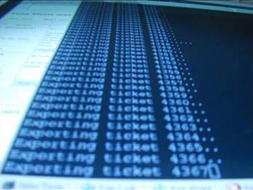

---

## Introduction to Machine Learning

- **ID**: 6.036
- **Scope**: Undergraduate
- **Title**: Introduction to Machine Learning
- **Link**: <https://ocw.mit.edu/courses/6-036-introduction-to-machine-learning-fall-2020/>
- **Professors**: 
	- Prof. Duane Boning
	- Prof. Isaac Chuang
	- Prof. Leslie Kaelbling
- **Topics**: 
	- Engineering
	- Computer Science
	- Artificial Intelligence
- 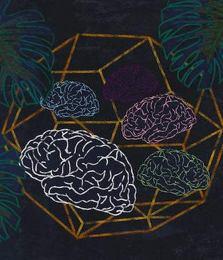

---

## Probabilistic Systems Analysis and Applied Probability

- **ID**: 6.041
- **Scope**: Undergraduate
- **Title**: Probabilistic Systems Analysis and Applied Probability
- **Link**: <https://ocw.mit.edu/courses/6-041-probabilistic-systems-analysis-and-applied-probability-fall-2010/>
- **Professors**: 
	- Prof. John Tsitsiklis
- **Topics**: 
	- Engineering
	- Mathematics
	- Systems Engineering
- 

---

## Probabilistic Systems Analysis and Applied Probability

- **ID**: 6.041
- **Scope**: Undergraduate
- **Title**: Probabilistic Systems Analysis and Applied Probability
- **Link**: <https://ocw.mit.edu/courses/6-041-probabilistic-systems-analysis-and-applied-probability-spring-2006/>
- **Professors**: 
	- Prof. Munther Dahleh
- **Topics**: 
	- Mathematics
	- Probability and Statistics
	- Discrete Mathematics
- 

---

## Probabilistic Systems Analysis and Applied Probability

- **ID**: 6.041SC
- **Scope**: Undergraduate
- **Title**: Probabilistic Systems Analysis and Applied Probability
- **Link**: <https://ocw.mit.edu/courses/6-041sc-probabilistic-systems-analysis-and-applied-probability-fall-2013/>
- **Professors**: 
	- Prof. John Tsitsiklis
- **Topics**: 
	- Engineering
	- Mathematics
	- Systems Engineering
- 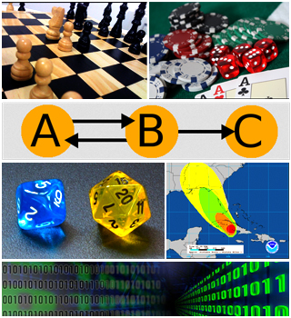

---

## Mathematics for Computer Science

- **ID**: 6.042J
- **Scope**: Undergraduate
- **Title**: Mathematics for Computer Science
- **Link**: <https://ocw.mit.edu/courses/6-042j-mathematics-for-computer-science-spring-2015/>
- **Professors**: 
	- Prof. Adam Chlipala
	- Prof. Albert R. Meyer
- **Topics**: 
	- Engineering
	- Computer Science
	- Mathematics
- 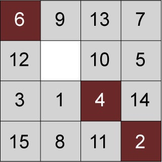

---

## Mathematics for Computer Science

- **ID**: 6.042J
- **Scope**: Undergraduate
- **Title**: Mathematics for Computer Science
- **Link**: <https://ocw.mit.edu/courses/6-042j-mathematics-for-computer-science-fall-2005/>
- **Professors**: 
	- Prof. Albert R. Meyer
	- Prof. Ronitt Rubinfeld
- **Topics**: 
	- Engineering
	- Computer Science
	- Mathematics
- 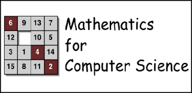

---

## Mathematics for Computer Science

- **ID**: 6.042J
- **Scope**: Undergraduate
- **Title**: Mathematics for Computer Science
- **Link**: <https://ocw.mit.edu/courses/6-042j-mathematics-for-computer-science-fall-2010/>
- **Professors**: 
	- Prof. Tom Leighton
- **Topics**: 
	- Engineering
	- Computer Science
	- Mathematics
- 

---

## Automata, Computability, and Complexity

- **ID**: 6.045J
- **Scope**: Undergraduate
- **Title**: Automata, Computability, and Complexity
- **Link**: <https://ocw.mit.edu/courses/6-045j-automata-computability-and-complexity-spring-2011/>
- **Professors**: 
	- Prof. Scott Aaronson
- **Topics**: 
	- Engineering
	- Computer Science
	- Mathematics
- 

---

## Introduction to Algorithms (SMA 5503)

- **ID**: 6.046J
- **Scope**: Undergraduate
- **Title**: Introduction to Algorithms (SMA 5503)
- **Link**: <https://ocw.mit.edu/courses/6-046j-introduction-to-algorithms-sma-5503-fall-2005/>
- **Professors**: 
	- Prof. Erik Demaine
	- Prof. Charles Leiserson
- **Topics**: 
	- Engineering
	- Computer Science
	- Algorithms and Data Structures
- 

---

## Design and Analysis of Algorithms

- **ID**: 6.046J
- **Scope**: Undergraduate
- **Title**: Design and Analysis of Algorithms
- **Link**: <https://ocw.mit.edu/courses/6-046j-design-and-analysis-of-algorithms-spring-2015/>
- **Professors**: 
	- Prof. Erik Demaine
	- Prof. Srini Devadas
	- Prof. Nancy Lynch
- **Topics**: 
	- Engineering
	- Computer Science
	- Mathematics
- 

---

## Design and Analysis of Algorithms

- **ID**: 6.046J
- **Scope**: Undergraduate
- **Title**: Design and Analysis of Algorithms
- **Link**: <https://ocw.mit.edu/courses/6-046j-design-and-analysis-of-algorithms-spring-2012/>
- **Professors**: 
	- Prof. Dana Moshkovitz
	- Prof. Bruce Tidor
- **Topics**: 
	- Engineering
	- Computer Science
	- Algorithms and Data Structures
- 

---

## Computational Biology

- **ID**: 6.047
- **Scope**: Undergraduate
- **Title**: Computational Biology
- **Link**: <https://ocw.mit.edu/courses/6-047-computational-biology-fall-2015/>
- **Professors**: 
	- Prof. Manolis Kellis
- **Topics**: 
	- Engineering
	- Biological Engineering
	- Computational Biology
- 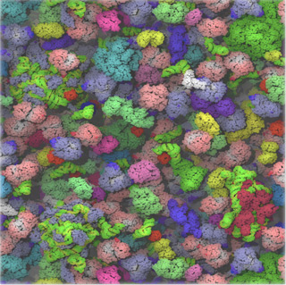

---

## Information and Entropy

- **ID**: 6.050J
- **Scope**: Undergraduate
- **Title**: Information and Entropy
- **Link**: <https://ocw.mit.edu/courses/6-050j-information-and-entropy-spring-2008/>
- **Professors**: 
	- Prof. Seth Lloyd
	- Prof. Paul Penfield
- **Topics**: 
	- Engineering
	- Computer Science
	- Mathematics
- 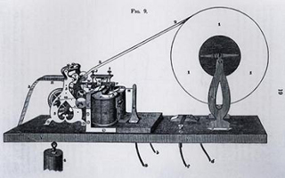

---

## The Art of Approximation in Science and Engineering

- **ID**: 6.055J
- **Scope**: Undergraduate
- **Title**: The Art of Approximation in Science and Engineering
- **Link**: <https://ocw.mit.edu/courses/6-055j-the-art-of-approximation-in-science-and-engineering-spring-2008/>
- **Topics**: 
	- Engineering
	- Computer Science
	- Mathematics
- 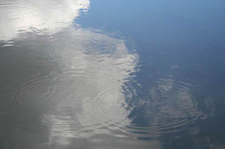

---

## Introduction to MATLAB

- **ID**: 6.057
- **Scope**: Undergraduate
- **Title**: Introduction to MATLAB
- **Link**: <https://ocw.mit.edu/courses/6-057-introduction-to-matlab-january-iap-2019/>
- **Topics**: 
	- Engineering
	- Computer Science
	- Programming Languages
- 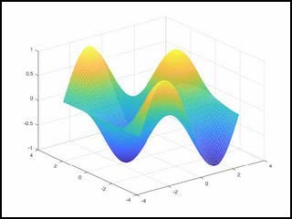

---

## Introduction to Electric Power Systems

- **ID**: 6.061
- **Scope**: Undergraduate
- **Title**: Introduction to Electric Power Systems
- **Link**: <https://ocw.mit.edu/courses/6-061-introduction-to-electric-power-systems-spring-2011/>
- **Professors**: 
	- Prof. James L. Kirtley
- **Topics**: 
	- Engineering
	- Electrical Engineering
	- Electric Power
- 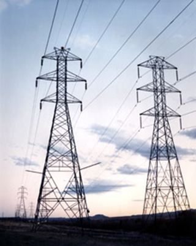

---

## Introduction to Electronics, Signals, and Measurement

- **ID**: 6.071J
- **Scope**: Undergraduate
- **Title**: Introduction to Electronics, Signals, and Measurement
- **Link**: <https://ocw.mit.edu/courses/6-071j-introduction-to-electronics-signals-and-measurement-spring-2006/>
- **Professors**: 
	- Prof. Manos Chaniotakis
	- Prof. David Cory
	- Prof. Ian Hutchinson
- **Topics**: 
	- Engineering
	- Electronics
	- Mathematics
- 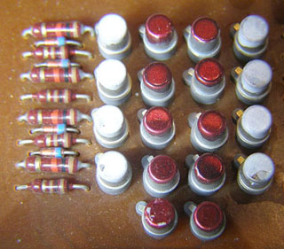

---

## Creating Video Games

- **ID**: 6.073
- **Scope**: Undergraduate
- **Title**: Creating Video Games
- **Link**: <https://ocw.mit.edu/courses/cms-611j-creating-video-games-fall-2014/>
- **Topics**: 
	- Engineering
	- Computer Science
	- Media Studies
- 

---

## Introduction to Convex Optimization

- **ID**: 6.079
- **Scope**: Undergraduate
- **Title**: Introduction to Convex Optimization
- **Link**: <https://ocw.mit.edu/courses/6-079-introduction-to-convex-optimization-fall-2009/>
- **Professors**: 
	- Prof. Stephen Boyd
	- Prof. Pablo Parrilo
- **Topics**: 
	- Engineering
	- Mathematics
	- Systems Engineering
- 

---

## Projects in Microscale Engineering for the Life Sciences

- **ID**: 6.07J
- **Scope**: Undergraduate
- **Title**: Projects in Microscale Engineering for the Life Sciences
- **Link**: <https://ocw.mit.edu/courses/hst-410j-projects-in-microscale-engineering-for-the-life-sciences-spring-2007/>
- **Professors**: 
	- Prof. Alexander Aranyosi
	- Prof. Dennis Freeman
	- Prof. Martha Gray
- **Topics**: 
	- Engineering
	- Mechanical Engineering
	- Biological Engineering
- 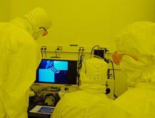

---

## Great Ideas in Theoretical Computer Science

- **ID**: 6.080
- **Scope**: Undergraduate
- **Title**: Great Ideas in Theoretical Computer Science
- **Link**: <https://ocw.mit.edu/courses/6-080-great-ideas-in-theoretical-computer-science-spring-2008/>
- **Professors**: 
	- Prof. Scott Aaronson
- **Topics**: 
	- Engineering
	- Computer Science
	- Mathematics
- 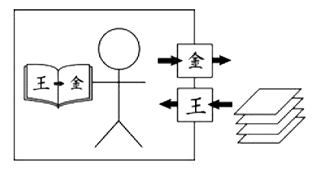

---

## Practical Programming in C

- **ID**: 6.087
- **Scope**: Undergraduate
- **Title**: Practical Programming in C
- **Link**: <https://ocw.mit.edu/courses/6-087-practical-programming-in-c-january-iap-2010/>
- **Topics**: 
	- Engineering
	- Computer Science
	- Software Design and Engineering
- 

---

## Introduction to C Memory Management and C++ Object-Oriented Programming

- **ID**: 6.088
- **Scope**: Undergraduate
- **Title**: Introduction to C Memory Management and C++ Object-Oriented Programming
- **Link**: <https://ocw.mit.edu/courses/6-088-introduction-to-c-memory-management-and-c-object-oriented-programming-january-iap-2010/>
- **Topics**: 
	- Engineering
	- Computer Science
	- Software Design and Engineering
- 

---

## Building Programming Experience: A Lead-In to 6.001

- **ID**: 6.090
- **Scope**: Undergraduate
- **Title**: Building Programming Experience: A Lead-In to 6.001
- **Link**: <https://ocw.mit.edu/courses/6-090-building-programming-experience-a-lead-in-to-6-001-january-iap-2005/>
- **Topics**: 
	- Engineering
	- Computer Science
	- Software Design and Engineering
- 

---

## Hands-On Introduction to Electrical Engineering Lab Skills

- **ID**: 6.091
- **Scope**: Undergraduate
- **Title**: Hands-On Introduction to Electrical Engineering Lab Skills
- **Link**: <https://ocw.mit.edu/courses/6-091-hands-on-introduction-to-electrical-engineering-lab-skills-january-iap-2008/>
- **Topics**: 
	- Engineering
	- Electrical Engineering
- 

---

## Java Preparation for 6.170

- **ID**: 6.092
- **Scope**: Undergraduate
- **Title**: Java Preparation for 6.170
- **Link**: <https://ocw.mit.edu/courses/6-092-java-preparation-for-6-170-january-iap-2006/>
- **Topics**: 
	- Engineering
	- Computer Science
	- Software Design and Engineering
- 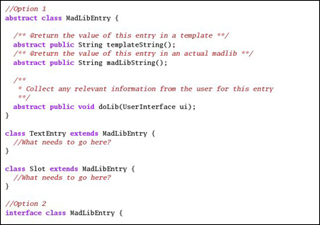

---

## Introduction to Programming in Java

- **ID**: 6.092
- **Scope**: Undergraduate
- **Title**: Introduction to Programming in Java
- **Link**: <https://ocw.mit.edu/courses/6-092-introduction-to-programming-in-java-january-iap-2010/>
- **Topics**: 
	- Engineering
	- Computer Science
	- Software Design and Engineering
- 

---

## Bioinformatics and Proteomics

- **ID**: 6.092
- **Scope**: Undergraduate
- **Title**: Bioinformatics and Proteomics
- **Link**: <https://ocw.mit.edu/courses/6-092-bioinformatics-and-proteomics-january-iap-2005/>
- **Professors**: 
	- Prof. Gil Alterovitz
	- Prof. Manolis Kellis
	- Prof. Marco Ramoni
- **Topics**: 
	- Engineering
	- Science
	- Computer Science
- 

---

## Algorithms for Computational Biology

- **ID**: 6.096
- **Scope**: Undergraduate
- **Title**: Algorithms for Computational Biology
- **Link**: <https://ocw.mit.edu/courses/6-096-algorithms-for-computational-biology-spring-2005/>
- **Professors**: 
	- Prof. Manolis Kellis
- **Topics**: 
	- Engineering
	- Computer Science
	- Biological Engineering
- 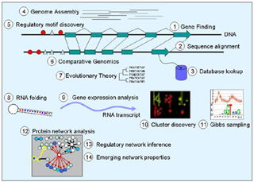

---

## Introduction to C++

- **ID**: 6.096
- **Scope**: Undergraduate
- **Title**: Introduction to C++
- **Link**: <https://ocw.mit.edu/courses/6-096-introduction-to-c-january-iap-2011/>
- **Topics**: 
	- Engineering
	- Computer Science
	- Software Design and Engineering
- 

---

## Fundamentals of Photonics: Quantum Electronics

- **ID**: 6.097
- **Scope**: Graduate
- **Title**: Fundamentals of Photonics: Quantum Electronics
- **Link**: <https://ocw.mit.edu/courses/6-974-fundamentals-of-photonics-quantum-electronics-spring-2006/>
- **Professors**: 
	- Prof. Franz Kärtner
- **Topics**: 
	- Engineering
	- Science
	- Physics
- 

---

## Street-Fighting Mathematics

- **ID**: 6.099
- **Scope**: Undergraduate
- **Title**: Street-Fighting Mathematics
- **Link**: <https://ocw.mit.edu/courses/18-098-street-fighting-mathematics-january-iap-2008/>
- **Topics**: 
	- Mathematics
	- Computation
	- Calculus
- 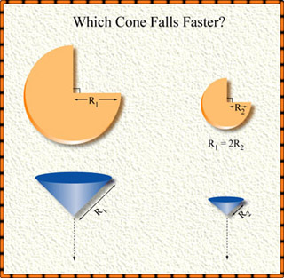

---

## Introductory Analog Electronics Laboratory

- **ID**: 6.101
- **Scope**: Undergraduate
- **Title**: Introductory Analog Electronics Laboratory
- **Link**: <https://ocw.mit.edu/courses/6-101-introductory-analog-electronics-laboratory-spring-2007/>
- **Topics**: 
	- Engineering
	- Electronics
	- Electrical Engineering
- 

---

## Introductory Digital Systems Laboratory

- **ID**: 6.111
- **Scope**: Undergraduate
- **Title**: Introductory Digital Systems Laboratory
- **Link**: <https://ocw.mit.edu/courses/6-111-introductory-digital-systems-laboratory-fall-2002/>
- **Professors**: 
	- Prof. James L. Kirtley
	- Prof. Don Troxel
- **Topics**: 
	- Engineering
	- Computer Science
	- Electronics
- 

---

## Introductory Digital Systems Laboratory

- **ID**: 6.111
- **Scope**: Undergraduate
- **Title**: Introductory Digital Systems Laboratory
- **Link**: <https://ocw.mit.edu/courses/6-111-introductory-digital-systems-laboratory-spring-2006/>
- **Professors**: 
	- Prof. Anantha Chandrakasan
- **Topics**: 
	- Engineering
	- Computer Science
	- Electronics
- 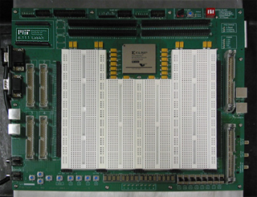

---

## Micro/Nano Processing Technology

- **ID**: 6.152J
- **Scope**: Undergraduate
- **Title**: Micro/Nano Processing Technology
- **Link**: <https://ocw.mit.edu/courses/6-152j-micro-nano-processing-technology-fall-2005/>
- **Professors**: 
	- Prof. Martin Schmidt
- **Topics**: 
	- Engineering
	- Mechanical Engineering
	- Electrical Engineering
- 

---

## Modern Optics Project Laboratory

- **ID**: 6.161
- **Scope**: Undergraduate
- **Title**: Modern Optics Project Laboratory
- **Link**: <https://ocw.mit.edu/courses/6-161-modern-optics-project-laboratory-fall-2005/>
- **Professors**: 
	- Prof. Cardinal Warde
- **Topics**: 
	- Engineering
	- Science
	- Physics
- 

---

## Strobe Project Laboratory

- **ID**: 6.163
- **Scope**: Undergraduate
- **Title**: Strobe Project Laboratory
- **Link**: <https://ocw.mit.edu/courses/6-163-strobe-project-laboratory-fall-2005/>
- **Topics**: 
	- Engineering
	- Science
	- Physics
- 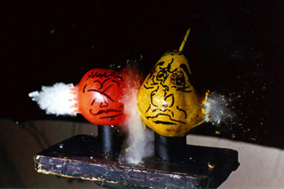

---

## Laboratory in Software Engineering

- **ID**: 6.170
- **Scope**: Undergraduate
- **Title**: Laboratory in Software Engineering
- **Link**: <https://ocw.mit.edu/courses/6-170-laboratory-in-software-engineering-fall-2005/>
- **Professors**: 
	- Prof. Srini Devadas
	- Prof. Daniel Jackson
- **Topics**: 
	- Engineering
	- Computer Science
	- Software Design and Engineering
- 

---

## Software Studio

- **ID**: 6.170
- **Scope**: Undergraduate
- **Title**: Software Studio
- **Link**: <https://ocw.mit.edu/courses/6-170-software-studio-spring-2013/>
- **Professors**: 
	- Prof. Daniel Jackson
- **Topics**: 
	- Engineering
	- Computer Science
	- Software Design and Engineering
- 

---

## Software Engineering for Web Applications

- **ID**: 6.171
- **Scope**: Undergraduate
- **Title**: Software Engineering for Web Applications
- **Link**: <https://ocw.mit.edu/courses/6-171-software-engineering-for-web-applications-fall-2003/>
- **Professors**: 
	- Prof. Harold Abelson
- **Topics**: 
	- Engineering
	- Computer Science
	- Electrical Engineering
- 

---

## Performance Engineering of Software Systems

- **ID**: 6.172
- **Scope**: Undergraduate
- **Title**: Performance Engineering of Software Systems
- **Link**: <https://ocw.mit.edu/courses/6-172-performance-engineering-of-software-systems-fall-2018/>
- **Professors**: 
	- Prof. Charles Leiserson
	- Prof. Julian Shun
- **Topics**: 
	- Engineering
	- Computer Science
	- Systems Engineering
- 

---

## Mobile Autonomous Systems Laboratory

- **ID**: 6.186
- **Scope**: Undergraduate
- **Title**: Mobile Autonomous Systems Laboratory
- **Link**: <https://ocw.mit.edu/courses/6-186-mobile-autonomous-systems-laboratory-january-iap-2005/>
- **Professors**: 
	- Prof. Leslie Kaelbling
- **Topics**: 
	- Engineering
	- Computer Science
	- Artificial Intelligence
- 

---

## A Gentle Introduction to Programming Using Python

- **ID**: 6.189
- **Scope**: Undergraduate
- **Title**: A Gentle Introduction to Programming Using Python
- **Link**: <https://ocw.mit.edu/courses/6-189-a-gentle-introduction-to-programming-using-python-january-iap-2008/>
- **Topics**: 
	- Engineering
	- Computer Science
	- Software Design and Engineering
- 

---

## A Gentle Introduction to Programming Using Python

- **ID**: 6.189
- **Scope**: Undergraduate
- **Title**: A Gentle Introduction to Programming Using Python
- **Link**: <https://ocw.mit.edu/courses/6-189-a-gentle-introduction-to-programming-using-python-january-iap-2011/>
- **Topics**: 
	- Engineering
	- Computer Science
	- Software Design and Engineering
- 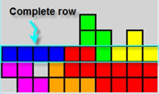

---

## Multicore Programming Primer

- **ID**: 6.189
- **Scope**: Undergraduate
- **Title**: Multicore Programming Primer
- **Link**: <https://ocw.mit.edu/courses/6-189-multicore-programming-primer-january-iap-2007/>
- **Professors**: 
	- Prof. Saman Amarasinghe
- **Topics**: 
	- Engineering
	- Computer Science
	- Software Design and Engineering
- 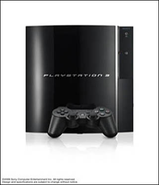

---

## Networks

- **ID**: 6.207
- **Scope**: Undergraduate, Graduate
- **Title**: Networks
- **Link**: <https://ocw.mit.edu/courses/14-15-networks-spring-2022/>
- **Professors**: 
	- Prof. Alexander Wolitzky
- **Topics**: 
	- Engineering
	- Computer Science
	- Economics
- 

---

## Networks

- **ID**: 6.207J
- **Scope**: Undergraduate
- **Title**: Networks
- **Link**: <https://ocw.mit.edu/courses/14-15j-networks-spring-2018/>
- **Topics**: 
	- Engineering
	- Computer Science
	- Economics
- 

---

## Dynamic Programming and Stochastic Control

- **ID**: 6.231
- **Scope**: Graduate
- **Title**: Dynamic Programming and Stochastic Control
- **Link**: <https://ocw.mit.edu/courses/6-231-dynamic-programming-and-stochastic-control-fall-2015/>
- **Professors**: 
	- Prof. Dimitri Bertsekas
- **Topics**: 
	- Engineering
	- Computer Science
	- Mathematics
- 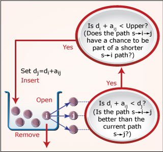

---

## Dynamic Systems and Control

- **ID**: 6.241J
- **Scope**: Graduate
- **Title**: Dynamic Systems and Control
- **Link**: <https://ocw.mit.edu/courses/6-241j-dynamic-systems-and-control-spring-2011/>
- **Professors**: 
	- Prof. Munther Dahleh
	- Prof. Emilio Frazzoli
- **Topics**: 
	- Engineering
	- Computer Science
	- Mathematics
- 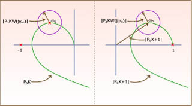

---

## Dynamics of Nonlinear Systems

- **ID**: 6.243J
- **Scope**: Graduate
- **Title**: Dynamics of Nonlinear Systems
- **Link**: <https://ocw.mit.edu/courses/6-243j-dynamics-of-nonlinear-systems-fall-2003/>
- **Professors**: 
	- Prof. Alexandre Megretski
- **Topics**: 
	- Engineering
	- Computer Science
	- Systems Engineering
- 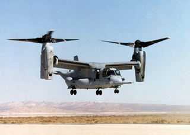

---

## Multivariable Control Systems

- **ID**: 6.245
- **Scope**: Graduate
- **Title**: Multivariable Control Systems
- **Link**: <https://ocw.mit.edu/courses/6-245-multivariable-control-systems-spring-2004/>
- **Professors**: 
	- Prof. Alexandre Megretski
- **Topics**: 
	- Engineering
	- Computer Science
	- Systems Engineering
- 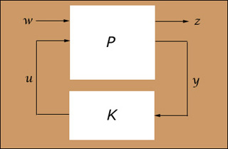

---

## Introduction to Mathematical Programming

- **ID**: 6.251J
- **Scope**: Graduate
- **Title**: Introduction to Mathematical Programming
- **Link**: <https://ocw.mit.edu/courses/6-251j-introduction-to-mathematical-programming-fall-2009/>
- **Professors**: 
	- Prof. Dimitris Bertsimas
- **Topics**: 
	- Engineering
	- Computer Science
	- Mathematics
- 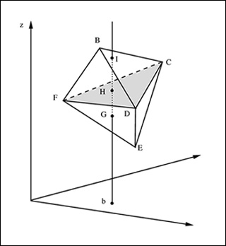

---

## Nonlinear Programming

- **ID**: 6.252J
- **Scope**: Graduate
- **Title**: Nonlinear Programming
- **Link**: <https://ocw.mit.edu/courses/15-084j-nonlinear-programming-spring-2004/>
- **Professors**: 
	- Prof. Robert Freund
- **Topics**: 
	- Engineering
	- Mathematics
	- Systems Engineering
- 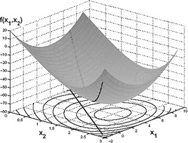

---

## Nonlinear Programming

- **ID**: 6.252J
- **Scope**: Graduate
- **Title**: Nonlinear Programming
- **Link**: <https://ocw.mit.edu/courses/6-252j-nonlinear-programming-spring-2003/>
- **Professors**: 
	- Prof. Dimitri Bertsekas
- **Topics**: 
	- Engineering
	- Computer Science
	- Systems Engineering
- 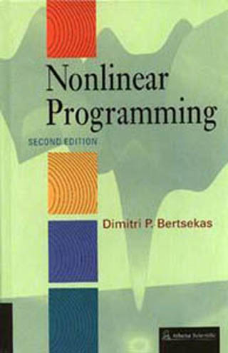

---

## Convex Analysis and Optimization

- **ID**: 6.253
- **Scope**: Graduate
- **Title**: Convex Analysis and Optimization
- **Link**: <https://ocw.mit.edu/courses/6-253-convex-analysis-and-optimization-spring-2012/>
- **Professors**: 
	- Prof. Dimitri Bertsekas
- **Topics**: 
	- Engineering
	- Computer Science
	- Mathematics
- 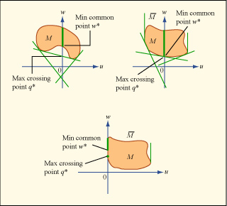

---

## Game Theory with Engineering Applications

- **ID**: 6.254
- **Scope**: Graduate
- **Title**: Game Theory with Engineering Applications
- **Link**: <https://ocw.mit.edu/courses/6-254-game-theory-with-engineering-applications-spring-2010/>
- **Professors**: 
	- Prof. Asuman Ozdaglar
- **Topics**: 
	- Engineering
	- Mechanical Engineering
	- Social Science
- 

---

## Optimization Methods

- **ID**: 6.255J
- **Scope**: Graduate
- **Title**: Optimization Methods
- **Link**: <https://ocw.mit.edu/courses/15-093j-optimization-methods-fall-2009/>
- **Professors**: 
	- Prof. Dimitris Bertsimas
- **Topics**: 
	- Engineering
	- Mathematics
	- Systems Engineering
- 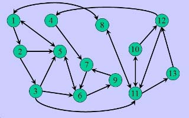

---

## Discrete Stochastic Processes

- **ID**: 6.262
- **Scope**: Graduate
- **Title**: Discrete Stochastic Processes
- **Link**: <https://ocw.mit.edu/courses/6-262-discrete-stochastic-processes-spring-2011/>
- **Professors**: 
	- Prof. Robert Gallager
- **Topics**: 
	- Mathematics
	- Probability and Statistics
	- Discrete Mathematics
- 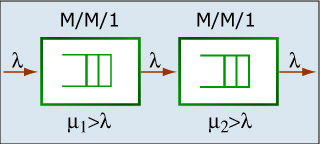

---

## Data Communication Networks

- **ID**: 6.263J
- **Scope**: Graduate
- **Title**: Data Communication Networks
- **Link**: <https://ocw.mit.edu/courses/6-263j-data-communication-networks-fall-2002/>
- **Professors**: 
	- Prof. Dimitri Bertsekas
	- Prof. Eytan Modiano
- **Topics**: 
	- Engineering
	- Computer Science
	- Electrical Engineering
- 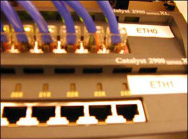

---

## Queues: Theory and Applications

- **ID**: 6.264J
- **Scope**: Graduate
- **Title**: Queues: Theory and Applications
- **Link**: <https://ocw.mit.edu/courses/15-072j-queues-theory-and-applications-spring-2006/>
- **Professors**: 
	- Prof. David Gamarnik
- **Topics**: 
	- Engineering
	- Mathematics
	- Systems Engineering
- 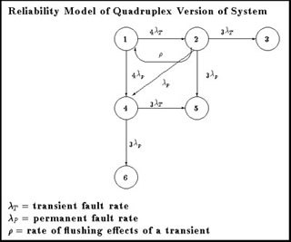

---

## Advanced Stochastic Processes

- **ID**: 6.265J
- **Scope**: Graduate
- **Title**: Advanced Stochastic Processes
- **Link**: <https://ocw.mit.edu/courses/15-070j-advanced-stochastic-processes-fall-2013/>
- **Professors**: 
	- Prof. David Gamarnik
- **Topics**: 
	- Mathematics
	- Probability and Statistics
- 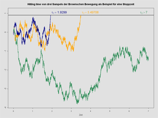

---

## Autonomous Robot Design Competition

- **ID**: 6.270
- **Scope**: Undergraduate
- **Title**: Autonomous Robot Design Competition
- **Link**: <https://ocw.mit.edu/courses/6-270-autonomous-robot-design-competition-january-iap-2005/>
- **Topics**: 
	- Engineering
	- Computer Science
	- Artificial Intelligence
- 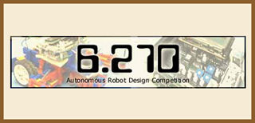

---

## Logistical and Transportation Planning Methods

- **ID**: 6.281J,15.073J,16.76J,ESD.216J
- **Scope**: Graduate
- **Title**: Logistical and Transportation Planning Methods
- **Link**: <https://ocw.mit.edu/courses/1-203j-logistical-and-transportation-planning-methods-fall-2006/>
- **Professors**: 
	- Prof. Arnold Barnett
	- Prof. Amedeo R. Odoni
- **Topics**: 
	- Engineering
	- Mathematics
	- Systems Engineering
- 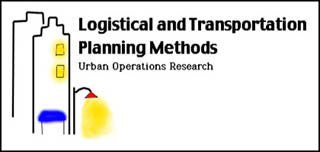

---

## Solid-State Circuits

- **ID**: 6.301
- **Scope**: Graduate
- **Title**: Solid-State Circuits
- **Link**: <https://ocw.mit.edu/courses/6-301-solid-state-circuits-fall-2010/>
- **Topics**: 
	- Engineering
	- Electronics
	- Electrical Engineering
- 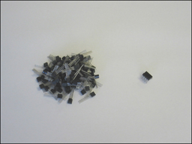

---

## Feedback Systems

- **ID**: 6.302
- **Scope**: Graduate
- **Title**: Feedback Systems
- **Link**: <https://ocw.mit.edu/courses/6-302-feedback-systems-spring-2007/>
- **Professors**: 
	- Prof. Joel Dawson
- **Topics**: 
	- Engineering
	- Electronics
	- Electrical Engineering
- 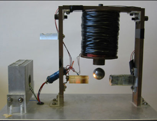

---

## Advanced Circuit Techniques

- **ID**: 6.331
- **Scope**: Graduate
- **Title**: Advanced Circuit Techniques
- **Link**: <https://ocw.mit.edu/courses/6-331-advanced-circuit-techniques-spring-2002/>
- **Topics**: 
	- Engineering
	- Electronics
	- Electrical Engineering
- 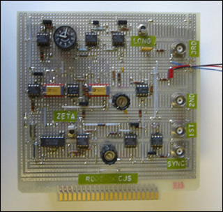

---

## Power Electronics

- **ID**: 6.334
- **Scope**: Graduate
- **Title**: Power Electronics
- **Link**: <https://ocw.mit.edu/courses/6-334-power-electronics-spring-2007/>
- **Professors**: 
	- Prof. David Perreault
- **Topics**: 
	- Engineering
	- Electronics
	- Electrical Engineering
- 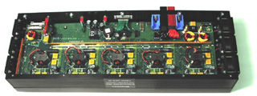

---

## Introduction to Numerical Simulation (SMA 5211)

- **ID**: 6.336J
- **Scope**: Graduate
- **Title**: Introduction to Numerical Simulation (SMA 5211)
- **Link**: <https://ocw.mit.edu/courses/6-336j-introduction-to-numerical-simulation-sma-5211-fall-2003/>
- **Professors**: 
	- Prof. Luca Daniel
	- Prof. Nicholas Hadjiconstantinou
	- Prof. Anthony T. Patera
- **Topics**: 
	- Engineering
	- Systems Engineering
	- Numerical Simulation
- 

---

## Introduction to Numerical Methods

- **ID**: 6.337J
- **Scope**: Graduate
- **Title**: Introduction to Numerical Methods
- **Link**: <https://ocw.mit.edu/courses/18-335j-introduction-to-numerical-methods-spring-2019/>
- **Professors**: 
	- Prof. Steven G. Johnson
- **Topics**: 
	- Engineering
	- Computer Science
	- Mathematics
- 

---

## Parallel Computing

- **ID**: 6.338J
- **Scope**: Graduate
- **Title**: Parallel Computing
- **Link**: <https://ocw.mit.edu/courses/18-337j-parallel-computing-fall-2011/>
- **Professors**: 
	- Prof. Alan Edelman
- **Topics**: 
	- Engineering
	- Computer Science
	- Mathematics
- 

---

## Discrete-Time Signal Processing

- **ID**: 6.341
- **Scope**: Graduate
- **Title**: Discrete-Time Signal Processing
- **Link**: <https://ocw.mit.edu/courses/6-341-discrete-time-signal-processing-fall-2005/>
- **Professors**: 
	- Prof. Alan V. Oppenheim
- **Topics**: 
	- Engineering
	- Mathematics
	- Electrical Engineering
- 

---

## Automatic Speech Recognition

- **ID**: 6.345
- **Scope**: Graduate
- **Title**: Automatic Speech Recognition
- **Link**: <https://ocw.mit.edu/courses/6-345-automatic-speech-recognition-spring-2003/>
- **Professors**: 
	- Prof. Victor Zue
- **Topics**: 
	- Engineering
	- Humanities
	- Electrical Engineering
- 

---

## The Battlecode Programming Competition

- **ID**: 6.370
- **Scope**: Undergraduate
- **Title**: The Battlecode Programming Competition
- **Link**: <https://ocw.mit.edu/courses/6-370-the-battlecode-programming-competition-january-iap-2013/>
- **Topics**: 
	- Engineering
	- Computer Science
	- Artificial Intelligence
- 

---

## Robocraft Programming Competition

- **ID**: 6.370
- **Scope**: Undergraduate
- **Title**: Robocraft Programming Competition
- **Link**: <https://ocw.mit.edu/courses/6-370-robocraft-programming-competition-january-iap-2005/>
- **Professors**: 
	- Prof. Michael Ernst
- **Topics**: 
	- Engineering
	- Computer Science
	- Artificial Intelligence
- 

---

## Analysis and Design of Digital Integrated Circuits

- **ID**: 6.374
- **Scope**: Graduate
- **Title**: Analysis and Design of Digital Integrated Circuits
- **Link**: <https://ocw.mit.edu/courses/6-374-analysis-and-design-of-digital-integrated-circuits-fall-2003/>
- **Professors**: 
	- Prof. Anantha Chandrakasan
- **Topics**: 
	- Engineering
	- Computer Science
	- Electronics
- 

---

## Robotic Manipulation

- **ID**: 6.4210
- **Scope**: Undergraduate, Graduate
- **Title**: Robotic Manipulation
- **Link**: <https://ocw.mit.edu/courses/6-4210-robotic-manipulation-fall-2022/>
- **Professors**: 
	- Prof. Russell Tedrake
- **Topics**: 
	- Engineering
	- Computer Science
	- Artificial Intelligence
- 

---

## Stochastic Processes, Detection, and Estimation

- **ID**: 6.432
- **Scope**: Graduate
- **Title**: Stochastic Processes, Detection, and Estimation
- **Link**: <https://ocw.mit.edu/courses/6-432-stochastic-processes-detection-and-estimation-spring-2004/>
- **Professors**: 
	- Prof. Alan Willsky
	- Prof. Gregory Wornell
- **Topics**: 
	- Engineering
	- Mathematics
	- Probability and Statistics
- 

---

## System Identification

- **ID**: 6.435
- **Scope**: Graduate
- **Title**: System Identification
- **Link**: <https://ocw.mit.edu/courses/6-435-system-identification-spring-2005/>
- **Professors**: 
	- Prof. Munther Dahleh
- **Topics**: 
	- Engineering
	- Mathematics
	- Systems Engineering
- 

---

## Fundamentals of Probability

- **ID**: 6.436J
- **Scope**: Graduate
- **Title**: Fundamentals of Probability
- **Link**: <https://ocw.mit.edu/courses/6-436j-fundamentals-of-probability-fall-2018/>
- **Professors**: 
	- Prof. Yury Polyanskiy
- **Topics**: 
	- Mathematics
	- Probability and Statistics
- 

---

## Algorithms for Inference

- **ID**: 6.438
- **Scope**: Graduate
- **Title**: Algorithms for Inference
- **Link**: <https://ocw.mit.edu/courses/6-438-algorithms-for-inference-fall-2014/>
- **Professors**: 
	- Prof. Devavrat Shah
- **Topics**: 
	- Engineering
	- Computer Science
	- Mathematics
- 

---

## Information Theory

- **ID**: 6.441
- **Scope**: Graduate
- **Title**: Information Theory
- **Link**: <https://ocw.mit.edu/courses/6-441-information-theory-spring-2010/>
- **Professors**: 
	- Prof. Muriel Médard
- **Topics**: 
	- Engineering
	- Computer Science
	- Electrical Engineering
- 

---

## Information Theory

- **ID**: 6.441
- **Scope**: Graduate
- **Title**: Information Theory
- **Link**: <https://ocw.mit.edu/courses/6-441-information-theory-spring-2016/>
- **Professors**: 
	- Prof. Yury Polyanskiy
- **Topics**: 
	- Engineering
	- Computer Science
	- Mathematics
- 

---

## Quantum Information Science

- **ID**: 6.443J,8.371J
- **Scope**: Graduate
- **Title**: Quantum Information Science
- **Link**: <https://ocw.mit.edu/courses/mas-865j-quantum-information-science-spring-2006/>
- **Professors**: 
	- Prof. Isaac Chuang
	- Prof. Peter Shor
- **Topics**: 
	- Engineering
	- Science
	- Computer Science
- 

---

## Principles of Digital Communications I

- **ID**: 6.450
- **Scope**: Graduate
- **Title**: Principles of Digital Communications I
- **Link**: <https://ocw.mit.edu/courses/6-450-principles-of-digital-communications-i-fall-2006/>
- **Professors**: 
	- Prof. Robert Gallager
	- Prof. Lizhong Zheng
- **Topics**: 
	- Engineering
	- Electrical Engineering
	- Telecommunications
- 

---

## Principles of Digital Communication I

- **ID**: 6.450
- **Scope**: Graduate
- **Title**: Principles of Digital Communication I
- **Link**: <https://ocw.mit.edu/courses/6-450-principles-of-digital-communication-i-fall-2009/>
- **Professors**: 
	- Prof. Muriel Médard
- **Topics**: 
	- Engineering
	- Electrical Engineering
	- Telecommunications
- 

---

## Principles of Digital Communication II

- **ID**: 6.451
- **Scope**: Graduate
- **Title**: Principles of Digital Communication II
- **Link**: <https://ocw.mit.edu/courses/6-451-principles-of-digital-communication-ii-spring-2005/>
- **Professors**: 
	- Prof. David Forney
- **Topics**: 
	- Engineering
	- Electrical Engineering
	- Telecommunications
- 

---

## Principles of Wireless Communications

- **ID**: 6.452
- **Scope**: Graduate
- **Title**: Principles of Wireless Communications
- **Link**: <https://ocw.mit.edu/courses/6-452-principles-of-wireless-communications-spring-2006/>
- **Professors**: 
	- Prof. Lizhong Zheng
- **Topics**: 
	- Engineering
	- Electrical Engineering
	- Telecommunications
- 

---

## Quantum Optical Communication

- **ID**: 6.453
- **Scope**: Graduate
- **Title**: Quantum Optical Communication
- **Link**: <https://ocw.mit.edu/courses/6-453-quantum-optical-communication-fall-2016/>
- **Professors**: 
	- Prof. Jeffrey Shapiro
- **Topics**: 
	- Engineering
	- Science
	- Physics
- 

---

## Speech Communication

- **ID**: 6.541J
- **Scope**: Graduate
- **Title**: Speech Communication
- **Link**: <https://ocw.mit.edu/courses/6-541j-speech-communication-spring-2004/>
- **Professors**: 
	- Prof. Kenneth Stevens
- **Topics**: 
	- Engineering
	- Humanities
	- Electrical Engineering
- 

---

## Laboratory on the Physiology, Acoustics, and Perception of Speech

- **ID**: 6.542J
- **Scope**: Graduate
- **Title**: Laboratory on the Physiology, Acoustics, and Perception of Speech
- **Link**: <https://ocw.mit.edu/courses/6-542j-laboratory-on-the-physiology-acoustics-and-perception-of-speech-fall-2005/>
- **Professors**: 
	- Prof. Kenneth Stevens
- **Topics**: 
	- Engineering
	- Humanities
	- Electrical Engineering
- 

---

## The Lexicon and Its Features

- **ID**: 6.543J,9.587J,HST.727J
- **Scope**: Graduate
- **Title**: The Lexicon and Its Features
- **Link**: <https://ocw.mit.edu/courses/24-941j-the-lexicon-and-its-features-spring-2007/>
- **Professors**: 
	- Prof. Edward Flemming
- **Topics**: 
	- Science
	- Humanities
	- Linguistics
- 

---

## Acoustics of Speech and Hearing

- **ID**: 6.551J
- **Scope**: Graduate
- **Title**: Acoustics of Speech and Hearing
- **Link**: <https://ocw.mit.edu/courses/6-551j-acoustics-of-speech-and-hearing-fall-2004/>
- **Professors**: 
	- Prof. Louis Braida
	- Prof. John Rosowski
	- Prof. Christopher Shera
- **Topics**: 
	- Engineering
	- Science
	- Electrical Engineering
- 

---

## Biomedical Signal and Image Processing

- **ID**: 6.555J,16.456J
- **Scope**: Graduate
- **Title**: Biomedical Signal and Image Processing
- **Link**: <https://ocw.mit.edu/courses/hst-582j-biomedical-signal-and-image-processing-spring-2007/>
- **Topics**: 
	- Engineering
	- Electrical Engineering
	- Health and Medicine
- 

---

## Foundations of Algorithms and Computational Techniques in Systems Biology

- **ID**: 6.581J
- **Scope**: Graduate
- **Title**: Foundations of Algorithms and Computational Techniques in Systems Biology
- **Link**: <https://ocw.mit.edu/courses/20-482j-foundations-of-algorithms-and-computational-techniques-in-systems-biology-spring-2006/>
- **Professors**: 
	- Prof. Bruce Tidor
	- Prof. Jacob White
- **Topics**: 
	- Engineering
	- Science
	- Computer Science
- 

---

## Electromagnetics

- **ID**: 6.630
- **Scope**: Graduate
- **Title**: Electromagnetics
- **Link**: <https://ocw.mit.edu/courses/6-630-electromagnetics-fall-2006/>
- **Professors**: 
	- Prof. Jin Au Kong
- **Topics**: 
	- Science
	- Physics
	- Electromagnetism
- 

---

## Electromagnetic Wave Theory

- **ID**: 6.632
- **Scope**: Graduate
- **Title**: Electromagnetic Wave Theory
- **Link**: <https://ocw.mit.edu/courses/6-632-electromagnetic-wave-theory-spring-2003/>
- **Professors**: 
	- Prof. Jin Au Kong
- **Topics**: 
	- Science
	- Physics
	- Mathematics
- 

---

## Advanced Electromagnetism

- **ID**: 6.635
- **Scope**: Graduate
- **Title**: Advanced Electromagnetism
- **Link**: <https://ocw.mit.edu/courses/6-635-advanced-electromagnetism-spring-2003/>
- **Professors**: 
	- Prof. Jin Au Kong
- **Topics**: 
	- Science
	- Physics
	- Atomic, Molecular, Optical Physics
- 

---

## Optical Signals, Devices, and Systems

- **ID**: 6.637
- **Scope**: Graduate
- **Title**: Optical Signals, Devices, and Systems
- **Link**: <https://ocw.mit.edu/courses/6-637-optical-signals-devices-and-systems-spring-2003/>
- **Professors**: 
	- Prof. Cardinal Warde
- **Topics**: 
	- Engineering
	- Science
	- Physics
- 

---

## Electromagnetic Fields, Forces, and Motion

- **ID**: 6.641
- **Scope**: Graduate
- **Title**: Electromagnetic Fields, Forces, and Motion
- **Link**: <https://ocw.mit.edu/courses/6-641-electromagnetic-fields-forces-and-motion-spring-2005/>
- **Topics**: 
	- Science
	- Physics
	- Electromagnetism
- 

---

## Electromagnetic Fields, Forces, and Motion

- **ID**: 6.641
- **Scope**: Graduate
- **Title**: Electromagnetic Fields, Forces, and Motion
- **Link**: <https://ocw.mit.edu/courses/6-641-electromagnetic-fields-forces-and-motion-spring-2009/>
- **Topics**: 
	- Science
	- Physics
	- Electromagnetism
- 

---

## Continuum Electromechanics

- **ID**: 6.642
- **Scope**: Graduate
- **Title**: Continuum Electromechanics
- **Link**: <https://ocw.mit.edu/courses/6-642-continuum-electromechanics-fall-2008/>
- **Topics**: 
	- Engineering
	- Science
	- Physics
- 

---

## Introduction to Plasma Physics I

- **ID**: 6.651J,8.613J
- **Scope**: Graduate
- **Title**: Introduction to Plasma Physics I
- **Link**: <https://ocw.mit.edu/courses/22-611j-introduction-to-plasma-physics-i-fall-2003/>
- **Professors**: 
	- Prof. Jeffrey Freidberg
	- Prof. Ian Hutchinson
- **Topics**: 
	- Science
	- Physics
	- Chemistry
- 

---

## Receivers, Antennas, and Signals

- **ID**: 6.661
- **Scope**: Graduate
- **Title**: Receivers, Antennas, and Signals
- **Link**: <https://ocw.mit.edu/courses/6-661-receivers-antennas-and-signals-spring-2003/>
- **Professors**: 
	- Prof. David Staelin
- **Topics**: 
	- Engineering
	- Electronics
	- Electrical Engineering
- 

---

## Electric Machines

- **ID**: 6.685
- **Scope**: Graduate
- **Title**: Electric Machines
- **Link**: <https://ocw.mit.edu/courses/6-685-electric-machines-fall-2013/>
- **Professors**: 
	- Prof. James L. Kirtley
- **Topics**: 
	- Engineering
	- Electronics
	- Electrical Engineering
- 

---

## Seminar in Electric Power Systems

- **ID**: 6.691
- **Scope**: Graduate
- **Title**: Seminar in Electric Power Systems
- **Link**: <https://ocw.mit.edu/courses/6-691-seminar-in-electric-power-systems-spring-2006/>
- **Professors**: 
	- Prof. James L. Kirtley
- **Topics**: 
	- Engineering
	- Electrical Engineering
	- Energy
- 

---

## Engineering, Economics and Regulation of the Electric Power Sector

- **ID**: 6.695,15.032J,ESD.162,6.974,IDS.505J (formerly ESD.934)
- **Scope**: Graduate
- **Title**: Engineering, Economics and Regulation of the Electric Power Sector
- **Link**: <https://ocw.mit.edu/courses/ids-505j-engineering-economics-and-regulation-of-the-electric-power-sector-spring-2010/>
- **Professors**: 
	- Prof. Ignacio Perez-Arriaga
- **Topics**: 
	- Engineering
	- Systems Engineering
	- Economics
- 

---

## Introduction to Nanoelectronics

- **ID**: 6.701
- **Scope**: Undergraduate
- **Title**: Introduction to Nanoelectronics
- **Link**: <https://ocw.mit.edu/courses/6-701-introduction-to-nanoelectronics-spring-2010/>
- **Professors**: 
	- Prof. Marc Baldo
- **Topics**: 
	- Engineering
	- Science
	- Physics
- 

---

## Integrated Microelectronic Devices

- **ID**: 6.720J
- **Scope**: Graduate
- **Title**: Integrated Microelectronic Devices
- **Link**: <https://ocw.mit.edu/courses/6-720j-integrated-microelectronic-devices-spring-2007/>
- **Professors**: 
	- Prof. Jesús del Alamo
- **Topics**: 
	- Engineering
	- Science
	- Physics
- 

---

## Applied Quantum and Statistical Physics

- **ID**: 6.728
- **Scope**: Graduate
- **Title**: Applied Quantum and Statistical Physics
- **Link**: <https://ocw.mit.edu/courses/6-728-applied-quantum-and-statistical-physics-fall-2006/>
- **Professors**: 
	- Prof. Terry Orlando
- **Topics**: 
	- Science
	- Physics
	- Mathematics
- 

---

## Physics for Solid-State Applications

- **ID**: 6.730
- **Scope**: Graduate
- **Title**: Physics for Solid-State Applications
- **Link**: <https://ocw.mit.edu/courses/6-730-physics-for-solid-state-applications-spring-2003/>
- **Professors**: 
	- Prof. Terry Orlando
	- Prof. Rajeev Ram
- **Topics**: 
	- Engineering
	- Science
	- Physics
- 

---

## Applied Superconductivity

- **ID**: 6.763
- **Scope**: Graduate
- **Title**: Applied Superconductivity
- **Link**: <https://ocw.mit.edu/courses/6-763-applied-superconductivity-fall-2005/>
- **Professors**: 
	- Prof. Terry Orlando
- **Topics**: 
	- Engineering
	- Science
	- Physics
- 

---

## Compound Semiconductor Devices

- **ID**: 6.772
- **Scope**: Graduate
- **Title**: Compound Semiconductor Devices
- **Link**: <https://ocw.mit.edu/courses/6-772-compound-semiconductor-devices-spring-2003/>
- **Professors**: 
	- Prof. Clifton Fonstad
- **Topics**: 
	- Engineering
	- Science
	- Physics
- 

---

## Physics of Microfabrication: Front End Processing

- **ID**: 6.774
- **Scope**: Graduate
- **Title**: Physics of Microfabrication: Front End Processing
- **Link**: <https://ocw.mit.edu/courses/6-774-physics-of-microfabrication-front-end-processing-fall-2004/>
- **Professors**: 
	- Prof. Judy Hoyt
	- Prof. L. Rafael Reif
- **Topics**: 
	- Engineering
	- Science
	- Physics
- 

---

## High Speed Communication Circuits

- **ID**: 6.776
- **Scope**: Graduate
- **Title**: High Speed Communication Circuits
- **Link**: <https://ocw.mit.edu/courses/6-776-high-speed-communication-circuits-spring-2005/>
- **Professors**: 
	- Prof. Hae-Seung Lee
	- Prof. Michael Perrott
- **Topics**: 
	- Engineering
	- Computer Science
	- Electrical Engineering
- 

---

## Design and Fabrication of Microelectromechanical Devices

- **ID**: 6.777J
- **Scope**: Graduate
- **Title**: Design and Fabrication of Microelectromechanical Devices
- **Link**: <https://ocw.mit.edu/courses/6-777j-design-and-fabrication-of-microelectromechanical-devices-spring-2007/>
- **Professors**: 
	- Prof. Carol Livermore
	- Prof. Joel Voldman
- **Topics**: 
	- Engineering
	- Science
	- Physics
- 

---

## Semiconductor Manufacturing

- **ID**: 6.780
- **Scope**: Graduate
- **Title**: Semiconductor Manufacturing
- **Link**: <https://ocw.mit.edu/courses/6-780-semiconductor-manufacturing-spring-2003/>
- **Professors**: 
	- Prof. Duane Boning
- **Topics**: 
	- Engineering
	- Electronics
	- Systems Engineering
- 

---

## Control of Manufacturing Processes (SMA 6303)

- **ID**: 6.780J,ESD.63J
- **Scope**: Graduate
- **Title**: Control of Manufacturing Processes (SMA 6303)
- **Link**: <https://ocw.mit.edu/courses/2-830j-control-of-manufacturing-processes-sma-6303-spring-2008/>
- **Professors**: 
	- Prof. Duane Boning
	- Prof. David Hardt
- **Topics**: 
	- Engineering
	- Mathematics
	- Mechanical Engineering
- 

---

## Submicrometer and Nanometer Technology

- **ID**: 6.781J
- **Scope**: Graduate
- **Title**: Submicrometer and Nanometer Technology
- **Link**: <https://ocw.mit.edu/courses/6-781j-submicrometer-and-nanometer-technology-spring-2006/>
- **Professors**: 
	- Prof. George Barbastathis
	- Prof. Karl Berggren
	- Prof. Henry Smith
- **Topics**: 
	- Engineering
	- Mechanical Engineering
	- Electrical Engineering
- 

---

## Machine Vision

- **ID**: 6.801
- **Scope**: Undergraduate
- **Title**: Machine Vision
- **Link**: <https://ocw.mit.edu/courses/6-801-machine-vision-fall-2020/>
- **Professors**: 
	- Prof. Berthold Horn
- **Topics**: 
	- Engineering
	- Computer Science
	- Artificial Intelligence
- 

---

## Machine Vision

- **ID**: 6.801
- **Scope**: Undergraduate
- **Title**: Machine Vision
- **Link**: <https://ocw.mit.edu/courses/6-801-machine-vision-fall-2004/>
- **Professors**: 
	- Prof. Berthold Horn
- **Topics**: 
	- Engineering
	- Computer Science
	- Artificial Intelligence
- 

---

## The Human Intelligence Enterprise

- **ID**: 6.803
- **Scope**: Undergraduate
- **Title**: The Human Intelligence Enterprise
- **Link**: <https://ocw.mit.edu/courses/6-803-the-human-intelligence-enterprise-spring-2019/>
- **Topics**: 
	- Engineering
	- Science
	- Computer Science
- 

---

## Ethics and the Law on the Electronic Frontier

- **ID**: 6.805
- **Scope**: Undergraduate
- **Title**: Ethics and the Law on the Electronic Frontier
- **Link**: <https://ocw.mit.edu/courses/6-805-ethics-and-the-law-on-the-electronic-frontier-fall-2005/>
- **Professors**: 
	- Prof. Harold Abelson
	- Prof. Michael M.J. Fischer
	- Prof. Daniel Weitzner
- **Topics**: 
	- Communication
	- Engineering
	- Computer Science
- 

---

## Interactive Music Systems

- **ID**: 6.809,21M.585
- **Scope**: Undergraduate
- **Title**: Interactive Music Systems
- **Link**: <https://ocw.mit.edu/courses/21m-385-interactive-music-systems-fall-2016/>
- **Topics**: 
	- Engineering
	- Computer Science
	- Music
- 

---

## Principles and Practice of Assistive Technology

- **ID**: 6.811
- **Scope**: Undergraduate
- **Title**: Principles and Practice of Assistive Technology
- **Link**: <https://ocw.mit.edu/courses/6-811-principles-and-practice-of-assistive-technology-fall-2014/>
- **Professors**: 
	- Prof. Robert Miller
- **Topics**: 
	- Engineering
	- Computer Science
	- Electronics
- 

---

## User Interface Design and Implementation

- **ID**: 6.813
- **Scope**: Graduate
- **Title**: User Interface Design and Implementation
- **Link**: <https://ocw.mit.edu/courses/6-831-user-interface-design-and-implementation-spring-2011/>
- **Professors**: 
	- Prof. Robert Miller
- **Topics**: 
	- Engineering
	- Computer Science
	- Visual Arts
- 

---

## Database Systems

- **ID**: 6.814
- **Scope**: Graduate, Undergraduate
- **Title**: Database Systems
- **Link**: <https://ocw.mit.edu/courses/6-830-database-systems-fall-2010/>
- **Professors**: 
	- Prof. Samuel Madden
	- Prof. Robert Morris
- **Topics**: 
	- Engineering
	- Computer Science
	- Business
- 

---

## Fundamentals of Program Analysis

- **ID**: 6.820
- **Scope**: Undergraduate
- **Title**: Fundamentals of Program Analysis
- **Link**: <https://ocw.mit.edu/courses/6-820-fundamentals-of-program-analysis-fall-2015/>
- **Professors**: 
	- Prof. Armando Solar-Lezama
- **Topics**: 
	- Engineering
	- Computer Science
	- Software Design and Engineering
- 

---

## Programming Languages

- **ID**: 6.821
- **Scope**: Graduate
- **Title**: Programming Languages
- **Link**: <https://ocw.mit.edu/courses/6-821-programming-languages-fall-2002/>
- **Professors**: 
	- Prof. Michael Ernst
- **Topics**: 
	- Engineering
	- Computer Science
	- Programming Languages
- 

---

## Computer System Architecture

- **ID**: 6.823
- **Scope**: Graduate
- **Title**: Computer System Architecture
- **Link**: <https://ocw.mit.edu/courses/6-823-computer-system-architecture-fall-2005/>
- **Professors**: 
	- Prof. Arvind
	- Prof. Krste Asanovic
- **Topics**: 
	- Engineering
	- Computer Science
	- Theory of Computation
- 

---

## Distributed Computer Systems Engineering

- **ID**: 6.824
- **Scope**: Graduate
- **Title**: Distributed Computer Systems Engineering
- **Link**: <https://ocw.mit.edu/courses/6-824-distributed-computer-systems-engineering-spring-2006/>
- **Professors**: 
	- Prof. Robert Morris
- **Topics**: 
	- Engineering
	- Computer Science
	- Computer Networks
- 

---

## Techniques in Artificial Intelligence (SMA 5504)

- **ID**: 6.825
- **Scope**: Graduate
- **Title**: Techniques in Artificial Intelligence (SMA 5504)
- **Link**: <https://ocw.mit.edu/courses/6-825-techniques-in-artificial-intelligence-sma-5504-fall-2002/>
- **Professors**: 
	- Prof. Leslie Kaelbling
	- Prof. Tomás Lozano-Pérez
- **Topics**: 
	- Engineering
	- Science
	- Computer Science
- 

---

## Principles of Computer Systems

- **ID**: 6.826
- **Scope**: Graduate
- **Title**: Principles of Computer Systems
- **Link**: <https://ocw.mit.edu/courses/6-826-principles-of-computer-systems-spring-2002/>
- **Professors**: 
	- Prof. Butler Lampson
	- Prof. Martin Rinard
- **Topics**: 
	- Engineering
	- Computer Science
	- Theory of Computation
- 

---

## Multithreaded Parallelism: Languages and Compilers

- **ID**: 6.827
- **Scope**: Graduate
- **Title**: Multithreaded Parallelism: Languages and Compilers
- **Link**: <https://ocw.mit.edu/courses/6-827-multithreaded-parallelism-languages-and-compilers-fall-2002/>
- **Professors**: 
	- Prof. Arvind
- **Topics**: 
	- Engineering
	- Computer Science
	- Software Design and Engineering
- 

---

## Operating System Engineering

- **ID**: 6.828
- **Scope**: Graduate
- **Title**: Operating System Engineering
- **Link**: <https://ocw.mit.edu/courses/6-828-operating-system-engineering-fall-2012/>
- **Professors**: 
	- Prof. Frans Kaashoek
- **Topics**: 
	- Engineering
	- Computer Science
	- Software Design and Engineering
- 

---

## Computer Networks

- **ID**: 6.829
- **Scope**: Graduate
- **Title**: Computer Networks
- **Link**: <https://ocw.mit.edu/courses/6-829-computer-networks-fall-2002/>
- **Professors**: 
	- Prof. Hari Balakrishnan
- **Topics**: 
	- Engineering
	- Computer Science
	- Computer Networks
- 

---

## Underactuated Robotics

- **ID**: 6.832
- **Scope**: Graduate
- **Title**: Underactuated Robotics
- **Link**: <https://ocw.mit.edu/courses/6-832-underactuated-robotics-spring-2009/>
- **Professors**: 
	- Prof. Russell Tedrake
- **Topics**: 
	- Engineering
	- Computer Science
	- Artificial Intelligence
- 

---

## Underactuated Robotics

- **ID**: 6.832
- **Scope**: Graduate
- **Title**: Underactuated Robotics
- **Link**: <https://ocw.mit.edu/courses/6-832-underactuated-robotics-spring-2022/>
- **Professors**: 
	- Prof. Russell Tedrake
- **Topics**: 
	- Engineering
	- Computer Science
	- Artificial Intelligence
- 

---

## Cognitive Robotics

- **ID**: 6.834J
- **Scope**: Graduate
- **Title**: Cognitive Robotics
- **Link**: <https://ocw.mit.edu/courses/16-412j-cognitive-robotics-spring-2016/>
- **Professors**: 
	- Prof. Brian Charles Williams
- **Topics**: 
	- Engineering
	- Computer Science
	- Artificial Intelligence
- 

---

## Computer Graphics

- **ID**: 6.837
- **Scope**: Undergraduate
- **Title**: Computer Graphics
- **Link**: <https://ocw.mit.edu/courses/6-837-computer-graphics-fall-2012/>
- **Professors**: 
	- Prof. Frédo Durand
	- Prof. Wojciech Matusik
- **Topics**: 
	- Engineering
	- Computer Science
	- Programming Languages
- 

---

## Algorithms for Computer Animation

- **ID**: 6.838
- **Scope**: Graduate
- **Title**: Algorithms for Computer Animation
- **Link**: <https://ocw.mit.edu/courses/6-838-algorithms-for-computer-animation-fall-2002/>
- **Professors**: 
	- Prof. Jovan Popovic
- **Topics**: 
	- Engineering
	- Computer Science
	- Programming Languages
- 

---

## Advanced Complexity Theory

- **ID**: 6.841J
- **Scope**: Graduate
- **Title**: Advanced Complexity Theory
- **Link**: <https://ocw.mit.edu/courses/18-405j-advanced-complexity-theory-spring-2016/>
- **Professors**: 
	- Prof. Dana Moshkovitz
- **Topics**: 
	- Engineering
	- Computer Science
	- Mathematics
- 

---

## Computability Theory of and with Scheme

- **ID**: 6.844
- **Scope**: Graduate
- **Title**: Computability Theory of and with Scheme
- **Link**: <https://ocw.mit.edu/courses/6-844-computability-theory-of-and-with-scheme-spring-2003/>
- **Professors**: 
	- Prof. Albert R. Meyer
- **Topics**: 
	- Engineering
	- Computer Science
	- Mathematics
- 

---

## Quantum Complexity Theory

- **ID**: 6.845
- **Scope**: Graduate
- **Title**: Quantum Complexity Theory
- **Link**: <https://ocw.mit.edu/courses/6-845-quantum-complexity-theory-fall-2010/>
- **Professors**: 
	- Prof. Scott Aaronson
- **Topics**: 
	- Engineering
	- Science
	- Computer Science
- 

---

## Geometric Folding Algorithms: Linkages, Origami, Polyhedra

- **ID**: 6.849
- **Scope**: Graduate
- **Title**: Geometric Folding Algorithms: Linkages, Origami, Polyhedra
- **Link**: <https://ocw.mit.edu/courses/6-849-geometric-folding-algorithms-linkages-origami-polyhedra-fall-2012/>
- **Professors**: 
	- Prof. Erik Demaine
- **Topics**: 
	- Engineering
	- Computer Science
	- Mathematics
- 

---

## Advanced Data Structures

- **ID**: 6.851
- **Scope**: Graduate
- **Title**: Advanced Data Structures
- **Link**: <https://ocw.mit.edu/courses/6-851-advanced-data-structures-spring-2012/>
- **Professors**: 
	- Prof. Erik Demaine
- **Topics**: 
	- Engineering
	- Computer Science
	- Algorithms and Data Structures
- 

---

## Distributed Algorithms

- **ID**: 6.852J
- **Scope**: Graduate
- **Title**: Distributed Algorithms
- **Link**: <https://ocw.mit.edu/courses/6-852j-distributed-algorithms-fall-2009/>
- **Professors**: 
	- Prof. Nancy Lynch
- **Topics**: 
	- Engineering
	- Computer Science
	- Algorithms and Data Structures
- 

---

## Advanced Algorithms

- **ID**: 6.854J
- **Scope**: Graduate
- **Title**: Advanced Algorithms
- **Link**: <https://ocw.mit.edu/courses/6-854j-advanced-algorithms-fall-2008/>
- **Professors**: 
	- Prof. Michel Goemans
- **Topics**: 
	- Engineering
	- Computer Science
	- Algorithms and Data Structures
- 

---

## Advanced Algorithms

- **ID**: 6.854J
- **Scope**: Graduate
- **Title**: Advanced Algorithms
- **Link**: <https://ocw.mit.edu/courses/6-854j-advanced-algorithms-fall-2005/>
- **Professors**: 
	- Prof. David R. Karger
- **Topics**: 
	- Engineering
	- Computer Science
	- Algorithms and Data Structures
- 

---

## Network Optimization

- **ID**: 6.855J,ESD.78J
- **Scope**: Graduate
- **Title**: Network Optimization
- **Link**: <https://ocw.mit.edu/courses/15-082j-network-optimization-fall-2010/>
- **Professors**: 
	- Prof. James Orlin
- **Topics**: 
	- Engineering
	- Computer Science
	- Mathematics
- 

---

## Randomized Algorithms

- **ID**: 6.856J
- **Scope**: Graduate
- **Title**: Randomized Algorithms
- **Link**: <https://ocw.mit.edu/courses/6-856j-randomized-algorithms-fall-2002/>
- **Professors**: 
	- Prof. David R. Karger
- **Topics**: 
	- Engineering
	- Computer Science
	- Mathematics
- 

---

## Network and Computer Security

- **ID**: 6.857
- **Scope**: Graduate
- **Title**: Network and Computer Security
- **Link**: <https://ocw.mit.edu/courses/6-857-network-and-computer-security-spring-2014/>
- **Professors**: 
	- Prof. Ronald Rivest
- **Topics**: 
	- Engineering
	- Computer Science
	- Social Science
- 

---

## Computer Systems Security

- **ID**: 6.858
- **Scope**: Graduate
- **Title**: Computer Systems Security
- **Link**: <https://ocw.mit.edu/courses/6-858-computer-systems-security-fall-2014/>
- **Professors**: 
	- Prof. Nickolai Zeldovich
- **Topics**: 
	- Engineering
	- Computer Science
	- Software Design and Engineering
- 

---

## Integer Programming and Combinatorial Optimization

- **ID**: 6.859J
- **Scope**: Graduate
- **Title**: Integer Programming and Combinatorial Optimization
- **Link**: <https://ocw.mit.edu/courses/15-083j-integer-programming-and-combinatorial-optimization-fall-2009/>
- **Professors**: 
	- Prof. Dimitris Bertsimas
	- Prof. Andreas Schulz
- **Topics**: 
	- Engineering
	- Mathematics
	- Systems Engineering
- 

---

## Natural Language and the Computer Representation of Knowledge

- **ID**: 6.863J
- **Scope**: Graduate
- **Title**: Natural Language and the Computer Representation of Knowledge
- **Link**: <https://ocw.mit.edu/courses/6-863j-natural-language-and-the-computer-representation-of-knowledge-spring-2003/>
- **Professors**: 
	- Prof. Robert Berwick
- **Topics**: 
	- Engineering
	- Science
	- Computer Science
- 

---

## Advanced Natural Language Processing

- **ID**: 6.864
- **Scope**: Graduate
- **Title**: Advanced Natural Language Processing
- **Link**: <https://ocw.mit.edu/courses/6-864-advanced-natural-language-processing-fall-2005/>
- **Professors**: 
	- Prof. Regina Barzilay
	- Prof. Michael Collins
- **Topics**: 
	- Engineering
	- Science
	- Computer Science
- 

---

## Machine Learning

- **ID**: 6.867
- **Scope**: Graduate
- **Title**: Machine Learning
- **Link**: <https://ocw.mit.edu/courses/6-867-machine-learning-fall-2006/>
- **Professors**: 
	- Prof. Tommi Jaakkola
- **Topics**: 
	- Engineering
	- Science
	- Computer Science
- 

---

## The Society of Mind

- **ID**: 6.868J
- **Scope**: Graduate
- **Title**: The Society of Mind
- **Link**: <https://ocw.mit.edu/courses/6-868j-the-society-of-mind-fall-2011/>
- **Professors**: 
	- Prof. Marvin Minsky
- **Topics**: 
	- Engineering
	- Computer Science
	- Humanities
- 

---

## Knowledge-Based Applications Systems

- **ID**: 6.871
- **Scope**: Graduate
- **Title**: Knowledge-Based Applications Systems
- **Link**: <https://ocw.mit.edu/courses/6-871-knowledge-based-applications-systems-spring-2005/>
- **Professors**: 
	- Prof. Randall Davis
- **Topics**: 
	- Engineering
	- Computer Science
	- Artificial Intelligence
- 

---

## Biomedical Computing

- **ID**: 6.872
- **Scope**: Graduate
- **Title**: Biomedical Computing
- **Link**: <https://ocw.mit.edu/courses/hst-950j-biomedical-computing-fall-2010/>
- **Professors**: 
	- Prof. Gil Alterovitz
	- Prof. Peter Szolovits
- **Topics**: 
	- Engineering
	- Biological Engineering
	- Health and Medicine
- 

---

## Medical Computing

- **ID**: 6.872J
- **Scope**: Graduate
- **Title**: Medical Computing
- **Link**: <https://ocw.mit.edu/courses/hst-950j-medical-computing-spring-2003/>
- **Professors**: 
	- Prof. Isaac Kohane
	- Prof. Lucila Ohno-Machado
	- Prof. Peter Szolovits
- **Topics**: 
	- Engineering
	- Computer Science
	- Biological Engineering
- 

---

## Medical Decision Support

- **ID**: 6.873J
- **Scope**: Graduate
- **Title**: Medical Decision Support
- **Link**: <https://ocw.mit.edu/courses/hst-951j-medical-decision-support-fall-2005/>
- **Professors**: 
	- Prof. Lucila Ohno-Machado
	- Prof. Staal Vinterbo
- **Topics**: 
	- Engineering
	- Computer Science
	- Artificial Intelligence
- 

---

## Medical Decision Support

- **ID**: 6.873J
- **Scope**: Graduate
- **Title**: Medical Decision Support
- **Link**: <https://ocw.mit.edu/courses/hst-951j-medical-decision-support-spring-2003/>
- **Professors**: 
	- Prof. Isaac Kohane
	- Prof. Lucila Ohno-Machado
	- Prof. Peter Szolovits
- **Topics**: 
	- Engineering
	- Computer Science
	- Artificial Intelligence
- 

---

## Computational Functional Genomics

- **ID**: 6.874J
- **Scope**: Graduate
- **Title**: Computational Functional Genomics
- **Link**: <https://ocw.mit.edu/courses/7-90j-computational-functional-genomics-spring-2005/>
- **Professors**: 
	- Prof. David Gifford
	- Prof. Tommi Jaakkola
- **Topics**: 
	- Science
	- Health and Medicine
	- Biology
- 

---

## Cryptography and Cryptanalysis

- **ID**: 6.875
- **Scope**: Graduate
- **Title**: Cryptography and Cryptanalysis
- **Link**: <https://ocw.mit.edu/courses/6-875-cryptography-and-cryptanalysis-spring-2005/>
- **Professors**: 
	- Prof. Silvio Micali
- **Topics**: 
	- Engineering
	- Computer Science
	- Cryptography
- 

---

## Advanced Topics in Cryptography

- **ID**: 6.876J
- **Scope**: Graduate
- **Title**: Advanced Topics in Cryptography
- **Link**: <https://ocw.mit.edu/courses/6-876j-advanced-topics-in-cryptography-spring-2003/>
- **Professors**: 
	- Prof. Silvio Micali
- **Topics**: 
	- Engineering
	- Computer Science
	- Cryptography
- 

---

## Computational Evolutionary Biology

- **ID**: 6.877J
- **Scope**: Graduate
- **Title**: Computational Evolutionary Biology
- **Link**: <https://ocw.mit.edu/courses/6-877j-computational-evolutionary-biology-fall-2005/>
- **Professors**: 
	- Prof. Robert Berwick
- **Topics**: 
	- Engineering
	- Science
	- Biological Engineering
- 

---

## Representation and Modeling for Image Analysis

- **ID**: 6.881
- **Scope**: Graduate
- **Title**: Representation and Modeling for Image Analysis
- **Link**: <https://ocw.mit.edu/courses/6-881-representation-and-modeling-for-image-analysis-spring-2005/>
- **Professors**: 
	- Prof. Polina Golland
- **Topics**: 
	- Engineering
	- Computer Science
	- Systems Engineering
- 

---

## Computational Personal Genomics: Making Sense of Complete Genomes

- **ID**: 6.881
- **Scope**: Graduate
- **Title**: Computational Personal Genomics: Making Sense of Complete Genomes
- **Link**: <https://ocw.mit.edu/courses/6-881-computational-personal-genomics-making-sense-of-complete-genomes-spring-2016/>
- **Professors**: 
	- Prof. Manolis Kellis
- **Topics**: 
	- Science
	- Biology
	- Genetics
- 

---

## Pervasive Human Centric Computing (SMA 5508)

- **ID**: 6.883
- **Scope**: Graduate
- **Title**: Pervasive Human Centric Computing (SMA 5508)
- **Link**: <https://ocw.mit.edu/courses/6-883-pervasive-human-centric-computing-sma-5508-spring-2006/>
- **Topics**: 
	- Engineering
	- Computer Science
	- Programming Languages
- 

---

## Program Analysis

- **ID**: 6.883
- **Scope**: Graduate
- **Title**: Program Analysis
- **Link**: <https://ocw.mit.edu/courses/6-883-program-analysis-fall-2005/>
- **Professors**: 
	- Prof. Michael Ernst
- **Topics**: 
	- Engineering
	- Computer Science
	- Software Design and Engineering
- 

---

## Complex Digital Systems

- **ID**: 6.884
- **Scope**: Graduate
- **Title**: Complex Digital Systems
- **Link**: <https://ocw.mit.edu/courses/6-884-complex-digital-systems-spring-2005/>
- **Professors**: 
	- Prof. Arvind
	- Prof. Krste Asanovic
- **Topics**: 
	- Engineering
	- Computer Science
	- Mathematics
- 

---

## Algorithmic Lower Bounds: Fun with Hardness Proofs

- **ID**: 6.890
- **Scope**: Graduate
- **Title**: Algorithmic Lower Bounds: Fun with Hardness Proofs
- **Link**: <https://ocw.mit.edu/courses/6-890-algorithmic-lower-bounds-fun-with-hardness-proofs-fall-2014/>
- **Professors**: 
	- Prof. Erik Demaine
- **Topics**: 
	- Engineering
	- Computer Science
	- Mathematics
- 

---

## Computational Models of Discourse

- **ID**: 6.892
- **Scope**: Graduate
- **Title**: Computational Models of Discourse
- **Link**: <https://ocw.mit.edu/courses/6-892-computational-models-of-discourse-spring-2004/>
- **Professors**: 
	- Prof. Regina Barzilay
- **Topics**: 
	- Engineering
	- Computer Science
	- Humanities
- 

---

## Theory of Parallel Systems (SMA 5509)

- **ID**: 6.895
- **Scope**: Graduate
- **Title**: Theory of Parallel Systems (SMA 5509)
- **Link**: <https://ocw.mit.edu/courses/6-895-theory-of-parallel-systems-sma-5509-fall-2003/>
- **Professors**: 
	- Prof. Michael Bender
	- Prof. Hsu Wen Jing
- **Topics**: 
	- Engineering
	- Computer Science
	- Algorithms and Data Structures
- 

---

## Essential Coding Theory

- **ID**: 6.895
- **Scope**: Graduate
- **Title**: Essential Coding Theory
- **Link**: <https://ocw.mit.edu/courses/6-895-essential-coding-theory-fall-2004/>
- **Professors**: 
	- Prof. Madhu Sudan
- **Topics**: 
	- Engineering
	- Computer Science
	- Algorithms and Data Structures
- 

---

## Theory of Parallel Hardware (SMA 5511)

- **ID**: 6.896
- **Scope**: Graduate
- **Title**: Theory of Parallel Hardware (SMA 5511)
- **Link**: <https://ocw.mit.edu/courses/6-896-theory-of-parallel-hardware-sma-5511-spring-2004/>
- **Professors**: 
	- Prof. Michael Bender
	- Prof. Charles Leiserson
- **Topics**: 
	- Engineering
	- Computer Science
	- Algorithms and Data Structures
- 

---

## Selected Topics in Cryptography

- **ID**: 6.897
- **Scope**: Graduate
- **Title**: Selected Topics in Cryptography
- **Link**: <https://ocw.mit.edu/courses/6-897-selected-topics-in-cryptography-spring-2004/>
- **Professors**: 
	- Prof. Ran Canetti
- **Topics**: 
	- Engineering
	- Computer Science
	- Cryptography
- 

---

## Inventions and Patents

- **ID**: 6.901
- **Scope**: Undergraduate
- **Title**: Inventions and Patents
- **Link**: <https://ocw.mit.edu/courses/6-901-inventions-and-patents-fall-2005/>
- **Topics**: 
	- Entrepreneurship
	- Innovation
	- Social Science
- 

---

## Engineering Innovation and Design

- **ID**: 6.902J
- **Scope**: Undergraduate
- **Title**: Engineering Innovation and Design
- **Link**: <https://ocw.mit.edu/courses/esd-051j-engineering-innovation-and-design-fall-2012/>
- **Professors**: 
	- Prof. Joel E Schindall
- **Topics**: 
	- Engineering
	- Innovation
	- Systems Engineering
- 

---

## Patents, Copyrights, and the Law of Intellectual Property

- **ID**: 6.903J
- **Scope**: Undergraduate
- **Title**: Patents, Copyrights, and the Law of Intellectual Property
- **Link**: <https://ocw.mit.edu/courses/15-628j-patents-copyrights-and-the-law-of-intellectual-property-spring-2013/>
- **Topics**: 
	- Management
	- Social Science
	- Public Administration
- 

---

## Transcribing Prosodic Structure of Spoken Utterances with ToBI

- **ID**: 6.911
- **Scope**: Undergraduate
- **Title**: Transcribing Prosodic Structure of Spoken Utterances with ToBI
- **Link**: <https://ocw.mit.edu/courses/6-911-transcribing-prosodic-structure-of-spoken-utterances-with-tobi-january-iap-2006/>
- **Topics**: 
	- Engineering
	- Science
	- Computer Science
- 

---

## Introduction to Copyright Law

- **ID**: 6.912
- **Scope**: Undergraduate
- **Title**: Introduction to Copyright Law
- **Link**: <https://ocw.mit.edu/courses/6-912-introduction-to-copyright-law-january-iap-2006/>
- **Topics**: 
	- Social Science
	- Legal Studies
- 

---

## Development of Inventions and Creative Ideas

- **ID**: 6.931
- **Scope**: Graduate
- **Title**: Development of Inventions and Creative Ideas
- **Link**: <https://ocw.mit.edu/courses/6-931-development-of-inventions-and-creative-ideas-spring-2008/>
- **Topics**: 
	- Engineering
	- Innovation
	- Social Science
- 

---

## The Structure of Engineering Revolutions

- **ID**: 6.933J
- **Scope**: Graduate
- **Title**: The Structure of Engineering Revolutions
- **Link**: <https://ocw.mit.edu/courses/6-933j-the-structure-of-engineering-revolutions-fall-2001/>
- **Professors**: 
	- Prof. David Mindell
- **Topics**: 
	- Engineering
	- Entrepreneurship
	- Innovation
- 

---

## Adventures in Advanced Symbolic Programming

- **ID**: 6.945
- **Scope**: Graduate
- **Title**: Adventures in Advanced Symbolic Programming
- **Link**: <https://ocw.mit.edu/courses/6-945-adventures-in-advanced-symbolic-programming-spring-2009/>
- **Professors**: 
	- Prof. Gerald Sussman
- **Topics**: 
	- Engineering
	- Computer Science
	- Artificial Intelligence
- 

---

## Classical Mechanics: A Computational Approach

- **ID**: 6.946J,8.351J
- **Scope**: Graduate
- **Title**: Classical Mechanics: A Computational Approach
- **Link**: <https://ocw.mit.edu/courses/12-620j-classical-mechanics-a-computational-approach-fall-2008/>
- **Professors**: 
	- Prof. Gerald Sussman
	- Prof. Jack Wisdom
- **Topics**: 
	- Engineering
	- Science
	- Physics
- 

---

## Biomedical Devices Design Laboratory

- **ID**: 6.971
- **Scope**: Graduate
- **Title**: Biomedical Devices Design Laboratory
- **Link**: <https://ocw.mit.edu/courses/2-996-biomedical-devices-design-laboratory-fall-2007/>
- **Topics**: 
	- Engineering
	- Electronics
	- Mechanical Engineering
- 

---

## Algebraic Techniques and Semidefinite Optimization

- **ID**: 6.972
- **Scope**: Graduate
- **Title**: Algebraic Techniques and Semidefinite Optimization
- **Link**: <https://ocw.mit.edu/courses/6-972-algebraic-techniques-and-semidefinite-optimization-spring-2006/>
- **Professors**: 
	- Prof. Pablo Parrilo
- **Topics**: 
	- Engineering
	- Mathematics
	- Systems Engineering
- 

---

## Communication System Design

- **ID**: 6.973
- **Scope**: Graduate
- **Title**: Communication System Design
- **Link**: <https://ocw.mit.edu/courses/6-973-communication-system-design-spring-2006/>
- **Professors**: 
	- Prof. Vladimir Stojanovic
- **Topics**: 
	- Engineering
	- Computer Science
	- Systems Engineering
- 

---

## Organic Optoelectronics

- **ID**: 6.973
- **Scope**: Graduate
- **Title**: Organic Optoelectronics
- **Link**: <https://ocw.mit.edu/courses/6-973-organic-optoelectronics-spring-2003/>
- **Professors**: 
	- Prof. Vladimir Bulovic
- **Topics**: 
	- Engineering
	- Mechanical Engineering
	- Biological Engineering
- 

---

## High Speed Communication Circuits and Systems

- **ID**: 6.976
- **Scope**: Graduate
- **Title**: High Speed Communication Circuits and Systems
- **Link**: <https://ocw.mit.edu/courses/6-976-high-speed-communication-circuits-and-systems-spring-2003/>
- **Professors**: 
	- Prof. Michael Perrott
- **Topics**: 
	- Engineering
	- Computer Science
	- Electrical Engineering
- 

---

## NextLab I: Designing Mobile Technologies for the Next Billion Users

- **ID**: 6.976,EC.S06
- **Scope**: Undergraduate
- **Title**: NextLab I: Designing Mobile Technologies for the Next Billion Users
- **Link**: <https://ocw.mit.edu/courses/mas-965-nextlab-i-designing-mobile-technologies-for-the-next-billion-users-fall-2008/>
- **Topics**: 
	- Engineering
	- Entrepreneurship
	- Social Science
- 

---

## Ultrafast Optics

- **ID**: 6.977
- **Scope**: Graduate
- **Title**: Ultrafast Optics
- **Link**: <https://ocw.mit.edu/courses/6-977-ultrafast-optics-spring-2005/>
- **Professors**: 
	- Prof. Franz Kärtner
- **Topics**: 
	- Engineering
	- Science
	- Physics
- 

---

## Semiconductor Optoelectronics: Theory and Design

- **ID**: 6.977
- **Scope**: Graduate
- **Title**: Semiconductor Optoelectronics: Theory and Design
- **Link**: <https://ocw.mit.edu/courses/6-977-semiconductor-optoelectronics-theory-and-design-fall-2002/>
- **Professors**: 
	- Prof. Rajeev Ram
- **Topics**: 
	- Engineering
	- Science
	- Physics
- 

---

## Communications and Information Policy

- **ID**: 6.978J
- **Scope**: Graduate
- **Title**: Communications and Information Policy
- **Link**: <https://ocw.mit.edu/courses/esd-68j-communications-and-information-policy-spring-2006/>
- **Topics**: 
	- Communication
	- Engineering
	- Social Science
- 

---

## Teaching College-Level Science and Engineering

- **ID**: 6.982J,7.59J,8.395J,18.094J
- **Scope**: Graduate
- **Title**: Teaching College-Level Science and Engineering
- **Link**: <https://ocw.mit.edu/courses/5-95j-teaching-college-level-science-and-engineering-spring-2009/>
- **Topics**: 
	- Engineering
	- Science
	- Teaching and Education
- 

---

## Teaching College-Level Science and Engineering

- **ID**: 6.982J,7.59J,8.395J,18.094J,1.95J,2.978J
- **Scope**: Graduate
- **Title**: Teaching College-Level Science and Engineering
- **Link**: <https://ocw.mit.edu/courses/5-95j-teaching-college-level-science-and-engineering-fall-2015/>
- **Topics**: 
	- Engineering
	- Teaching and Education
	- Educational Technology
- 

---

## Nanomaker

- **ID**: 6.S079
- **Scope**: Undergraduate
- **Title**: Nanomaker
- **Link**: <https://ocw.mit.edu/courses/6-s079-nanomaker-spring-2013/>
- **Professors**: 
	- Prof. Vladimir Bulovic
	- Prof. Rajeev Ram
- **Topics**: 
	- Engineering
	- Electronics
	- Electrical Engineering
- 

---

## Introduction to Computational Thinking

- **ID**: 6.S083
- **Scope**: Undergraduate
- **Title**: Introduction to Computational Thinking
- **Link**: <https://ocw.mit.edu/courses/18-s191-introduction-to-computational-thinking-fall-2022/>
- **Professors**: 
	- Prof. Alan Edelman
	- Prof. Charles Leiserson
	- Prof. David P. Sanders
- **Topics**: 
	- Engineering
	- Computer Science
	- Mathematics
- 

---

## Introduction to Computational Thinking with Julia, with Applications to Modeling the COVID-19 Pandemic

- **ID**: 6.S083
- **Scope**: Undergraduate
- **Title**: Introduction to Computational Thinking with Julia, with Applications to Modeling the COVID-19 Pandemic
- **Link**: <https://ocw.mit.edu/courses/18-s190-introduction-to-computational-thinking-with-julia-with-applications-to-modeling-the-covid-19-pandemic-spring-2020/>
- **Professors**: 
	- Prof. Alan Edelman
	- Prof. David P. Sanders
- **Topics**: 
	- Engineering
	- Computer Science
	- Mathematics
- 

---

## Introduction to Computational Thinking

- **ID**: 6.S083,22.S092
- **Scope**: Undergraduate
- **Title**: Introduction to Computational Thinking
- **Link**: <https://ocw.mit.edu/courses/18-s191-introduction-to-computational-thinking-fall-2020/>
- **Professors**: 
	- Prof. Alan Edelman
	- Prof. David P. Sanders
- **Topics**: 
	- Engineering
	- Computer Science
	- Mathematics
- 

---

## Programming for the Puzzled

- **ID**: 6.S095
- **Scope**: Undergraduate
- **Title**: Programming for the Puzzled
- **Link**: <https://ocw.mit.edu/courses/6-s095-programming-for-the-puzzled-january-iap-2018/>
- **Professors**: 
	- Prof. Srini Devadas
- **Topics**: 
	- Engineering
	- Computer Science
	- Programming Languages
- 

---

## Introduction to C and C++

- **ID**: 6.S096
- **Scope**: Undergraduate
- **Title**: Introduction to C and C++
- **Link**: <https://ocw.mit.edu/courses/6-s096-introduction-to-c-and-c-january-iap-2013/>
- **Topics**: 
	- Engineering
	- Computer Science
	- Software Design and Engineering
- 

---

## Effective Programming in C and C++

- **ID**: 6.S096
- **Scope**: Undergraduate
- **Title**: Effective Programming in C and C++
- **Link**: <https://ocw.mit.edu/courses/6-s096-effective-programming-in-c-and-c-january-iap-2014/>
- **Topics**: 
	- Engineering
	- Computer Science
	- Software Design and Engineering
- 

---

## Introduction to Deep Learning

- **ID**: 6.S191
- **Scope**: Undergraduate
- **Title**: Introduction to Deep Learning
- **Link**: <https://ocw.mit.edu/courses/6-s191-introduction-to-deep-learning-january-iap-2020/>
- **Topics**: 
	- Engineering
	- Computer Science
	- Artificial Intelligence
- 

---

## Machine Learning for Healthcare

- **ID**: 6.S897
- **Scope**: Graduate
- **Title**: Machine Learning for Healthcare
- **Link**: <https://ocw.mit.edu/courses/6-s897-machine-learning-for-healthcare-spring-2019/>
- **Professors**: 
	- Prof. David Sontag
	- Prof. Peter Szolovits
- **Topics**: 
	- Engineering
	- Computer Science
	- Artificial Intelligence
- 

---

## Climate Change Seminar

- **ID**: 6.S898
- **Scope**: Graduate
- **Title**: Climate Change Seminar
- **Link**: <https://ocw.mit.edu/courses/6-s898-climate-change-seminar-fall-2019/>
- **Professors**: 
	- Prof. Alan Edelman
	- Prof. John Fernandez
- **Topics**: 
	- Engineering
	- Science
	- Systems Engineering
- 

---

## Machine Learning for Inverse Graphics

- **ID**: 6.S980
- **Scope**: Graduate
- **Title**: Machine Learning for Inverse Graphics
- **Link**: <https://ocw.mit.edu/courses/6-s980-machine-learning-for-inverse-graphics-fall-2022/>
- **Professors**: 
	- Prof. Vincent Sitzmann
- **Topics**: 
	- Engineering
	- Computer Science
	- Artificial Intelligence
- 

---

## Ethics for Engineers: Artificial Intelligence

- **ID**: 10.01
- **Scope**: Undergraduate
- **Title**: Ethics for Engineers: Artificial Intelligence
- **Link**: <https://ocw.mit.edu/courses/10-01-ethics-for-engineers-artificial-intelligence-spring-2020/>
- **Professors**: 
	- Prof. Bernhardt Trout
- **Topics**: 
	- Engineering
	- Computer Science
	- Humanities
- 

---

## Molecular, Cellular and Tissue Biomechanics (BE.410J)

- **ID**: 20.410J
- **Scope**: Graduate
- **Title**: Molecular, Cellular and Tissue Biomechanics (BE.410J)
- **Link**: <https://ocw.mit.edu/courses/20-410j-molecular-cellular-and-tissue-biomechanics-be-410j-spring-2003/>
- **Professors**: 
	- Prof. Patrick Doyle
- **Topics**: 
	- Engineering
	- Science
	- Biological Engineering
- 

---

## Molecular, Cellular, and Tissue Biomechanics

- **ID**: 20.310J
- **Scope**: Undergraduate
- **Title**: Molecular, Cellular, and Tissue Biomechanics
- **Link**: <https://ocw.mit.edu/courses/20-310j-molecular-cellular-and-tissue-biomechanics-spring-2015/>
- **Professors**: 
	- Prof. Alan Grodzinsky
	- Prof. Roger Kamm
- **Topics**: 
	- Engineering
	- Science
	- Biological Engineering
- 

---

## Management in Engineering

- **ID**: 2.96
- **Scope**: Undergraduate
- **Title**: Management in Engineering
- **Link**: <https://ocw.mit.edu/courses/2-96-management-in-engineering-fall-2012/>
- **Professors**: 
	- Prof. Jung-Hoon Chun
	- Prof. Henry S. Marcus
- **Topics**: 
	- Entrepreneurship
	- Business
	- Project Management
- 

---

## Numerical Methods for Partial Differential Equations (SMA 5212)

- **ID**: 16.920J
- **Scope**: Graduate
- **Title**: Numerical Methods for Partial Differential Equations (SMA 5212)
- **Link**: <https://ocw.mit.edu/courses/16-920j-numerical-methods-for-partial-differential-equations-sma-5212-spring-2003/>
- **Professors**: 
	- Prof. Boo Cheong Khoo
	- Prof. Anthony T. Patera
	- Prof. Jaime Peraire
- **Topics**: 
	- Mathematics
	- Applied Mathematics
	- Differential Equations
- 

---

## Introduction to Plasma Physics I

- **ID**: 22.611J
- **Scope**: Graduate
- **Title**: Introduction to Plasma Physics I
- **Link**: <https://ocw.mit.edu/courses/22-611j-introduction-to-plasma-physics-i-fall-2006/>
- **Professors**: 
	- Prof. Ron Parker
- **Topics**: 
	- Science
	- Physics
	- Chemistry
- 

---

## Introduction to Bioengineering (BE.010J)

- **ID**: 20.010J
- **Scope**: Undergraduate
- **Title**: Introduction to Bioengineering (BE.010J)
- **Link**: <https://ocw.mit.edu/courses/20-010j-introduction-to-bioengineering-be-010j-spring-2006/>
- **Professors**: 
	- Prof. Angela M. Belcher
	- Prof. Douglas Lauffenburger
- **Topics**: 
	- Engineering
	- Science
	- Biological Engineering
- 

---

## Engineering Risk-Benefit Analysis

- **ID**: ESD.72
- **Scope**: Graduate
- **Title**: Engineering Risk-Benefit Analysis
- **Link**: <https://ocw.mit.edu/courses/esd-72-engineering-risk-benefit-analysis-spring-2007/>
- **Professors**: 
	- Prof. George Apostolakis
- **Topics**: 
	- Engineering
	- Mathematics
	- Systems Engineering
- 

---

## AI 101

- **ID**: RES.6-013
- **Scope**: Undergraduate
- **Title**: AI 101
- **Link**: <https://ocw.mit.edu/courses/res-6-013-ai-101-fall-2021/>
- **Topics**: 
	- Engineering
	- Computer Science
	- Artificial Intelligence
- 

---

## Quantitative Physiology: Organ Transport Systems

- **ID**: HST.542J
- **Scope**: Undergraduate
- **Title**: Quantitative Physiology: Organ Transport Systems
- **Link**: <https://ocw.mit.edu/courses/hst-542j-quantitative-physiology-organ-transport-systems-spring-2004/>
- **Professors**: 
	- Prof. Roger Mark
	- Prof. Jose Venegas
- **Topics**: 
	- Engineering
	- Science
	- Health and Medicine
- 

---

## Foundations of Computational and Systems Biology

- **ID**: 7.91J
- **Scope**: Graduate
- **Title**: Foundations of Computational and Systems Biology
- **Link**: <https://ocw.mit.edu/courses/7-91j-foundations-of-computational-and-systems-biology-spring-2014/>
- **Professors**: 
	- Prof. Christopher Burge
	- Prof. Ernest Fraenkel
	- Prof. David Gifford
- **Topics**: 
	- Engineering
	- Science
	- Systems Engineering
- 

---

## Computational Cognitive Science

- **ID**: 9.66J
- **Scope**: Undergraduate
- **Title**: Computational Cognitive Science
- **Link**: <https://ocw.mit.edu/courses/9-66j-computational-cognitive-science-fall-2004/>
- **Professors**: 
	- Prof. Joshua Tenenbaum
- **Topics**: 
	- Engineering
	- Science
	- Systems Engineering
- 

---

## Fields, Forces and Flows in Biological Systems

- **ID**: 20.330J
- **Scope**: Undergraduate
- **Title**: Fields, Forces and Flows in Biological Systems
- **Link**: <https://ocw.mit.edu/courses/20-330j-fields-forces-and-flows-in-biological-systems-spring-2007/>
- **Professors**: 
	- Prof. Jongyoon Han
	- Prof. Scott Manalis
- **Topics**: 
	- Engineering
	- Science
	- Mechanical Engineering
- 

---

## Fields, Forces, and Flows in Biological Systems

- **ID**: 20.430J
- **Scope**: Graduate
- **Title**: Fields, Forces, and Flows in Biological Systems
- **Link**: <https://ocw.mit.edu/courses/20-430j-fields-forces-and-flows-in-biological-systems-fall-2015/>
- **Professors**: 
	- Prof. Mark Bathe
	- Prof. Alan Grodzinsky
- **Topics**: 
	- Engineering
	- Science
	- Mechanical Engineering
- 

---

## Theory of Computation

- **ID**: 18.404J
- **Scope**: Undergraduate, Graduate
- **Title**: Theory of Computation
- **Link**: <https://ocw.mit.edu/courses/18-404j-theory-of-computation-fall-2020/>
- **Professors**: 
	- Prof. Michael Sipser
- **Topics**: 
	- Engineering
	- Computer Science
	- Mathematics
- 
