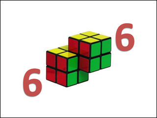
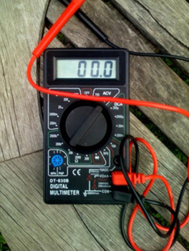
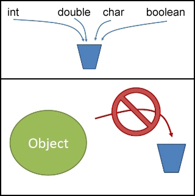
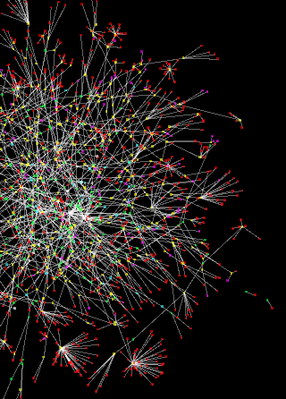
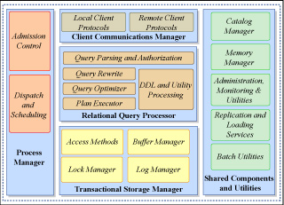
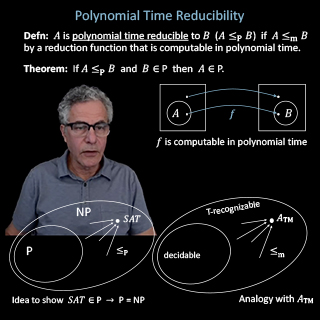

# OpenCourseWare Courses

---

## Introduction to Computer Science and Programming

- **ID**: 6.00
- **Scope**: Undergraduate
- **Title**: Introduction to Computer Science and Programming
- **Link**: <https://ocw.mit.edu/courses/6-00-introduction-to-computer-science-and-programming-fall-2008/>
- **Professors**: 
	- Prof. Eric Grimson
	- Prof. John Guttag
- **Topics**: 
	- Engineering
	- Computer Science
	- Programming Languages
- 

---

## Introduction to Computer Science and Programming in Python

- **ID**: 6.0001
- **Scope**: Undergraduate
- **Title**: Introduction to Computer Science and Programming in Python
- **Link**: <https://ocw.mit.edu/courses/6-0001-introduction-to-computer-science-and-programming-in-python-fall-2016/>
- **Professors**: 
	- Prof. Eric Grimson
	- Prof. John Guttag
- **Topics**: 
	- Engineering
	- Computer Science
	- Programming Languages
- 

---

## Introduction to Computational Thinking and Data Science

- **ID**: 6.0002
- **Scope**: Undergraduate
- **Title**: Introduction to Computational Thinking and Data Science
- **Link**: <https://ocw.mit.edu/courses/6-0002-introduction-to-computational-thinking-and-data-science-fall-2016/>
- **Professors**: 
	- Prof. Eric Grimson
	- Prof. John Guttag
- **Topics**: 
	- Engineering
	- Computer Science
	- Mathematics
- 

---

## Structure and Interpretation of Computer Programs

- **ID**: 6.001
- **Scope**: Undergraduate
- **Title**: Structure and Interpretation of Computer Programs
- **Link**: <https://ocw.mit.edu/courses/6-001-structure-and-interpretation-of-computer-programs-spring-2005/>
- **Professors**: 
	- Prof. Trevor Darrell
	- Prof. Eric Grimson
	- Prof. Peter Szolovits
- **Topics**: 
	- Engineering
	- Computer Science
	- Mathematics
- 

---

## Circuits and Electronics

- **ID**: 6.002
- **Scope**: Undergraduate
- **Title**: Circuits and Electronics
- **Link**: <https://ocw.mit.edu/courses/6-002-circuits-and-electronics-spring-2007/>
- **Professors**: 
	- Prof. Anant Agarwal
- **Topics**: 
	- Engineering
	- Electronics
	- Electrical Engineering
- 

---

## Signals and Systems

- **ID**: 6.003
- **Scope**: Undergraduate
- **Title**: Signals and Systems
- **Link**: <https://ocw.mit.edu/courses/6-003-signals-and-systems-fall-2011/>
- **Professors**: 
	- Prof. Dennis Freeman
- **Topics**: 
	- Engineering
	- Electrical Engineering
	- Signal Processing
- 

---

## Computation Structures

- **ID**: 6.004
- **Scope**: Undergraduate
- **Title**: Computation Structures
- **Link**: <https://ocw.mit.edu/courses/6-004-computation-structures-spring-2009/>
- **Professors**: 
	- Prof. Steve Ward
- **Topics**: 
	- Engineering
	- Computer Science
	- Mathematics
- 

---

## Computation Structures

- **ID**: 6.004
- **Scope**: Undergraduate
- **Title**: Computation Structures
- **Link**: <https://ocw.mit.edu/courses/6-004-computation-structures-spring-2017/>
- **Topics**: 
	- Engineering
	- Computer Science
	- Electrical Engineering
- 

---

## Elements of Software Construction

- **ID**: 6.005
- **Scope**: Undergraduate
- **Title**: Elements of Software Construction
- **Link**: <https://ocw.mit.edu/courses/6-005-elements-of-software-construction-fall-2008/>
- **Professors**: 
	- Prof. Daniel Jackson
	- Prof. Robert Miller
- **Topics**: 
	- Engineering
	- Computer Science
	- Software Design and Engineering
- 

---

## Software Construction

- **ID**: 6.005
- **Scope**: Undergraduate
- **Title**: Software Construction
- **Link**: <https://ocw.mit.edu/courses/6-005-software-construction-spring-2016/>
- **Professors**: 
	- Prof. Robert Miller
- **Topics**: 
	- Engineering
	- Computer Science
	- Software Design and Engineering
- 

---

## Introduction to Algorithms

- **ID**: 6.006
- **Scope**: Undergraduate
- **Title**: Introduction to Algorithms
- **Link**: <https://ocw.mit.edu/courses/6-006-introduction-to-algorithms-spring-2020/>
- **Professors**: 
	- Prof. Erik Demaine
	- Prof. Justin Solomon
- **Topics**: 
	- Engineering
	- Computer Science
	- Mathematics
- 

---

## Introduction to Algorithms

- **ID**: 6.006
- **Scope**: Undergraduate
- **Title**: Introduction to Algorithms
- **Link**: <https://ocw.mit.edu/courses/6-006-introduction-to-algorithms-spring-2008/>
- **Professors**: 
	- Prof. Erik Demaine
	- Prof. Srini Devadas
	- Prof. Ronald Rivest
- **Topics**: 
	- Engineering
	- Computer Science
	- Mathematics
- 

---

## Introduction to Algorithms

- **ID**: 6.006
- **Scope**: Undergraduate
- **Title**: Introduction to Algorithms
- **Link**: <https://ocw.mit.edu/courses/6-006-introduction-to-algorithms-fall-2011/>
- **Professors**: 
	- Prof. Erik Demaine
	- Prof. Srini Devadas
- **Topics**: 
	- Engineering
	- Computer Science
	- Algorithms and Data Structures
- 

---

## Electromagnetic Energy: From Motors to Lasers

- **ID**: 6.007
- **Scope**: Undergraduate
- **Title**: Electromagnetic Energy: From Motors to Lasers
- **Link**: <https://ocw.mit.edu/courses/6-007-electromagnetic-energy-from-motors-to-lasers-spring-2011/>
- **Professors**: 
	- Prof. Vladimir Bulovic
	- Prof. Jeffrey H. Lang
- **Topics**: 
	- Engineering
	- Science
	- Physics
- 

---

## Introduction to Computer Science and Programming

- **ID**: 6.00SC
- **Scope**: Undergraduate
- **Title**: Introduction to Computer Science and Programming
- **Link**: <https://ocw.mit.edu/courses/6-00sc-introduction-to-computer-science-and-programming-spring-2011/>
- **Professors**: 
	- Prof. John Guttag
- **Topics**: 
	- Engineering
	- Computer Science
- 

---

## Signals, Systems and Inference

- **ID**: 6.011
- **Scope**: Undergraduate
- **Title**: Signals, Systems and Inference
- **Link**: <https://ocw.mit.edu/courses/6-011-signals-systems-and-inference-spring-2018/>
- **Professors**: 
	- Prof. Peter Hagelstein
	- Prof. Alan V. Oppenheim
	- Prof. George Verghese
- **Topics**: 
	- Engineering
	- Electrical Engineering
	- Signal Processing
- 

---

## Introduction to Communication, Control, and Signal Processing

- **ID**: 6.011
- **Scope**: Undergraduate
- **Title**: Introduction to Communication, Control, and Signal Processing
- **Link**: <https://ocw.mit.edu/courses/6-011-introduction-to-communication-control-and-signal-processing-spring-2010/>
- **Professors**: 
	- Prof. Alan V. Oppenheim
	- Prof. George Verghese
- **Topics**: 
	- Engineering
	- Electrical Engineering
	- Signal Processing
- 

---

## Microelectronic Devices and Circuits

- **ID**: 6.012
- **Scope**: Undergraduate
- **Title**: Microelectronic Devices and Circuits
- **Link**: <https://ocw.mit.edu/courses/6-012-microelectronic-devices-and-circuits-fall-2009/>
- **Professors**: 
	- Prof. Clifton Fonstad
- **Topics**: 
	- Engineering
	- Computer Science
	- Electronics
- 

---

## Microelectronic Devices and Circuits

- **ID**: 6.012
- **Scope**: Undergraduate
- **Title**: Microelectronic Devices and Circuits
- **Link**: <https://ocw.mit.edu/courses/6-012-microelectronic-devices-and-circuits-fall-2005/>
- **Professors**: 
	- Prof. Jesús del Alamo
- **Topics**: 
	- Engineering
	- Computer Science
	- Electronics
- 

---

## Microelectronic Devices and Circuits

- **ID**: 6.012
- **Scope**: Undergraduate
- **Title**: Microelectronic Devices and Circuits
- **Link**: <https://ocw.mit.edu/courses/6-012-microelectronic-devices-and-circuits-spring-2009/>
- **Professors**: 
	- Prof. Akintunde Akinwande
	- Prof. Jesús del Alamo
	- Prof. Judy Hoyt
- **Topics**: 
	- Engineering
	- Computer Science
	- Electronics
- 

---

## Electromagnetics and Applications

- **ID**: 6.013
- **Scope**: Undergraduate
- **Title**: Electromagnetics and Applications
- **Link**: <https://ocw.mit.edu/courses/6-013-electromagnetics-and-applications-fall-2005/>
- **Professors**: 
	- Prof. Erich Ippen
	- Prof. David Staelin
- **Topics**: 
	- Engineering
	- Science
	- Physics
- 

---

## Electromagnetics and Applications

- **ID**: 6.013
- **Scope**: Undergraduate
- **Title**: Electromagnetics and Applications
- **Link**: <https://ocw.mit.edu/courses/6-013-electromagnetics-and-applications-spring-2009/>
- **Professors**: 
	- Prof. David Staelin
- **Topics**: 
	- Engineering
	- Science
	- Physics
- 

---

## Introduction to Electrical Engineering and Computer Science I

- **ID**: 6.01SC
- **Scope**: Undergraduate
- **Title**: Introduction to Electrical Engineering and Computer Science I
- **Link**: <https://ocw.mit.edu/courses/6-01sc-introduction-to-electrical-engineering-and-computer-science-i-spring-2011/>
- **Professors**: 
	- Prof. Harold Abelson
	- Prof. Isaac Chuang
	- Prof. Dennis Freeman
- **Topics**: 
	- Engineering
	- Computer Science
	- Artificial Intelligence
- 

---

## Introduction to EECS II: Digital Communication Systems

- **ID**: 6.02
- **Scope**: Undergraduate
- **Title**: Introduction to EECS II: Digital Communication Systems
- **Link**: <https://ocw.mit.edu/courses/6-02-introduction-to-eecs-ii-digital-communication-systems-fall-2012/>
- **Professors**: 
	- Prof. Hari Balakrishnan
	- Prof. George Verghese
- **Topics**: 
	- Engineering
	- Computer Science
	- Electrical Engineering
- 

---

## Quantitative Physiology: Cells and Tissues

- **ID**: 6.021J
- **Scope**: Undergraduate
- **Title**: Quantitative Physiology: Cells and Tissues
- **Link**: <https://ocw.mit.edu/courses/6-021j-quantitative-physiology-cells-and-tissues-fall-2004/>
- **Professors**: 
	- Prof. Dennis Freeman
- **Topics**: 
	- Science
	- Health and Medicine
	- Anatomy and Physiology
- 

---

## Computer System Engineering

- **ID**: 6.033
- **Scope**: Undergraduate
- **Title**: Computer System Engineering
- **Link**: <https://ocw.mit.edu/courses/6-033-computer-system-engineering-spring-2018/>
- **Topics**: 
	- Engineering
	- Computer Science
	- Software Design and Engineering
- 

---

## Artificial Intelligence

- **ID**: 6.034
- **Scope**: Undergraduate
- **Title**: Artificial Intelligence
- **Link**: <https://ocw.mit.edu/courses/6-034-artificial-intelligence-spring-2005/>
- **Professors**: 
	- Prof. Leslie Kaelbling
	- Prof. Tomás Lozano-Pérez
- **Topics**: 
	- Engineering
	- Computer Science
	- Artificial Intelligence
- 

---

## Artificial Intelligence

- **ID**: 6.034
- **Scope**: Undergraduate
- **Title**: Artificial Intelligence
- **Link**: <https://ocw.mit.edu/courses/6-034-artificial-intelligence-fall-2010/>
- **Topics**: 
	- Engineering
	- Computer Science
	- Artificial Intelligence
- 

---

## Computer Language Engineering

- **ID**: 6.035
- **Scope**: Undergraduate
- **Title**: Computer Language Engineering
- **Link**: <https://ocw.mit.edu/courses/6-035-computer-language-engineering-spring-2010/>
- **Professors**: 
	- Prof. Saman Amarasinghe
	- Prof. Martin Rinard
- **Topics**: 
	- Engineering
	- Computer Science
	- Software Design and Engineering
- 

---

## Computer Language Engineering (SMA 5502)

- **ID**: 6.035
- **Scope**: Undergraduate
- **Title**: Computer Language Engineering (SMA 5502)
- **Link**: <https://ocw.mit.edu/courses/6-035-computer-language-engineering-sma-5502-fall-2005/>
- **Professors**: 
	- Prof. Saman Amarasinghe
	- Prof. Martin Rinard
- **Topics**: 
	- Engineering
	- Computer Science
	- Software Design and Engineering
- 

---

## Introduction to Machine Learning

- **ID**: 6.036
- **Scope**: Undergraduate
- **Title**: Introduction to Machine Learning
- **Link**: <https://ocw.mit.edu/courses/6-036-introduction-to-machine-learning-fall-2020/>
- **Professors**: 
	- Prof. Duane Boning
	- Prof. Isaac Chuang
	- Prof. Leslie Kaelbling
- **Topics**: 
	- Engineering
	- Computer Science
	- Artificial Intelligence
- 

---

## Probabilistic Systems Analysis and Applied Probability

- **ID**: 6.041
- **Scope**: Undergraduate
- **Title**: Probabilistic Systems Analysis and Applied Probability
- **Link**: <https://ocw.mit.edu/courses/6-041-probabilistic-systems-analysis-and-applied-probability-fall-2010/>
- **Professors**: 
	- Prof. John Tsitsiklis
- **Topics**: 
	- Engineering
	- Mathematics
	- Systems Engineering
- 

---

## Probabilistic Systems Analysis and Applied Probability

- **ID**: 6.041
- **Scope**: Undergraduate
- **Title**: Probabilistic Systems Analysis and Applied Probability
- **Link**: <https://ocw.mit.edu/courses/6-041-probabilistic-systems-analysis-and-applied-probability-spring-2006/>
- **Professors**: 
	- Prof. Munther Dahleh
- **Topics**: 
	- Mathematics
	- Probability and Statistics
	- Discrete Mathematics
- 

---

## Probabilistic Systems Analysis and Applied Probability

- **ID**: 6.041SC
- **Scope**: Undergraduate
- **Title**: Probabilistic Systems Analysis and Applied Probability
- **Link**: <https://ocw.mit.edu/courses/6-041sc-probabilistic-systems-analysis-and-applied-probability-fall-2013/>
- **Professors**: 
	- Prof. John Tsitsiklis
- **Topics**: 
	- Engineering
	- Mathematics
	- Systems Engineering
- 

---

## Mathematics for Computer Science

- **ID**: 6.042J
- **Scope**: Undergraduate
- **Title**: Mathematics for Computer Science
- **Link**: <https://ocw.mit.edu/courses/6-042j-mathematics-for-computer-science-spring-2015/>
- **Professors**: 
	- Prof. Adam Chlipala
	- Prof. Albert R. Meyer
- **Topics**: 
	- Engineering
	- Computer Science
	- Mathematics
- 

---

## Mathematics for Computer Science

- **ID**: 6.042J
- **Scope**: Undergraduate
- **Title**: Mathematics for Computer Science
- **Link**: <https://ocw.mit.edu/courses/6-042j-mathematics-for-computer-science-fall-2005/>
- **Professors**: 
	- Prof. Albert R. Meyer
	- Prof. Ronitt Rubinfeld
- **Topics**: 
	- Engineering
	- Computer Science
	- Mathematics
- 

---

## Mathematics for Computer Science

- **ID**: 6.042J
- **Scope**: Undergraduate
- **Title**: Mathematics for Computer Science
- **Link**: <https://ocw.mit.edu/courses/6-042j-mathematics-for-computer-science-fall-2010/>
- **Professors**: 
	- Prof. Tom Leighton
- **Topics**: 
	- Engineering
	- Computer Science
	- Mathematics
- 

---

## Automata, Computability, and Complexity

- **ID**: 6.045J
- **Scope**: Undergraduate
- **Title**: Automata, Computability, and Complexity
- **Link**: <https://ocw.mit.edu/courses/6-045j-automata-computability-and-complexity-spring-2011/>
- **Professors**: 
	- Prof. Scott Aaronson
- **Topics**: 
	- Engineering
	- Computer Science
	- Mathematics
- 

---

## Introduction to Algorithms (SMA 5503)

- **ID**: 6.046J
- **Scope**: Undergraduate
- **Title**: Introduction to Algorithms (SMA 5503)
- **Link**: <https://ocw.mit.edu/courses/6-046j-introduction-to-algorithms-sma-5503-fall-2005/>
- **Professors**: 
	- Prof. Erik Demaine
	- Prof. Charles Leiserson
- **Topics**: 
	- Engineering
	- Computer Science
	- Algorithms and Data Structures
- 

---

## Design and Analysis of Algorithms

- **ID**: 6.046J
- **Scope**: Undergraduate
- **Title**: Design and Analysis of Algorithms
- **Link**: <https://ocw.mit.edu/courses/6-046j-design-and-analysis-of-algorithms-spring-2015/>
- **Professors**: 
	- Prof. Erik Demaine
	- Prof. Srini Devadas
	- Prof. Nancy Lynch
- **Topics**: 
	- Engineering
	- Computer Science
	- Mathematics
- 

---

## Design and Analysis of Algorithms

- **ID**: 6.046J
- **Scope**: Undergraduate
- **Title**: Design and Analysis of Algorithms
- **Link**: <https://ocw.mit.edu/courses/6-046j-design-and-analysis-of-algorithms-spring-2012/>
- **Professors**: 
	- Prof. Dana Moshkovitz
	- Prof. Bruce Tidor
- **Topics**: 
	- Engineering
	- Computer Science
	- Algorithms and Data Structures
- 

---

## Computational Biology

- **ID**: 6.047
- **Scope**: Undergraduate
- **Title**: Computational Biology
- **Link**: <https://ocw.mit.edu/courses/6-047-computational-biology-fall-2015/>
- **Professors**: 
	- Prof. Manolis Kellis
- **Topics**: 
	- Engineering
	- Biological Engineering
	- Computational Biology
- 

---

## Information and Entropy

- **ID**: 6.050J
- **Scope**: Undergraduate
- **Title**: Information and Entropy
- **Link**: <https://ocw.mit.edu/courses/6-050j-information-and-entropy-spring-2008/>
- **Professors**: 
	- Prof. Seth Lloyd
	- Prof. Paul Penfield
- **Topics**: 
	- Engineering
	- Computer Science
	- Mathematics
- 

---

## The Art of Approximation in Science and Engineering

- **ID**: 6.055J
- **Scope**: Undergraduate
- **Title**: The Art of Approximation in Science and Engineering
- **Link**: <https://ocw.mit.edu/courses/6-055j-the-art-of-approximation-in-science-and-engineering-spring-2008/>
- **Topics**: 
	- Engineering
	- Computer Science
	- Mathematics
- 

---

## Introduction to MATLAB

- **ID**: 6.057
- **Scope**: Undergraduate
- **Title**: Introduction to MATLAB
- **Link**: <https://ocw.mit.edu/courses/6-057-introduction-to-matlab-january-iap-2019/>
- **Topics**: 
	- Engineering
	- Computer Science
	- Programming Languages
- 

---

## Introduction to Electric Power Systems

- **ID**: 6.061
- **Scope**: Undergraduate
- **Title**: Introduction to Electric Power Systems
- **Link**: <https://ocw.mit.edu/courses/6-061-introduction-to-electric-power-systems-spring-2011/>
- **Professors**: 
	- Prof. James L. Kirtley
- **Topics**: 
	- Engineering
	- Electrical Engineering
	- Electric Power
- 

---

## Introduction to Electronics, Signals, and Measurement

- **ID**: 6.071J
- **Scope**: Undergraduate
- **Title**: Introduction to Electronics, Signals, and Measurement
- **Link**: <https://ocw.mit.edu/courses/6-071j-introduction-to-electronics-signals-and-measurement-spring-2006/>
- **Professors**: 
	- Prof. Manos Chaniotakis
	- Prof. David Cory
	- Prof. Ian Hutchinson
- **Topics**: 
	- Engineering
	- Electronics
	- Mathematics
- 

---

## Creating Video Games

- **ID**: 6.073
- **Scope**: Undergraduate
- **Title**: Creating Video Games
- **Link**: <https://ocw.mit.edu/courses/cms-611j-creating-video-games-fall-2014/>
- **Topics**: 
	- Engineering
	- Computer Science
	- Media Studies
- 

---

## Introduction to Convex Optimization

- **ID**: 6.079
- **Scope**: Undergraduate
- **Title**: Introduction to Convex Optimization
- **Link**: <https://ocw.mit.edu/courses/6-079-introduction-to-convex-optimization-fall-2009/>
- **Professors**: 
	- Prof. Stephen Boyd
	- Prof. Pablo Parrilo
- **Topics**: 
	- Engineering
	- Mathematics
	- Systems Engineering
- 

---

## Projects in Microscale Engineering for the Life Sciences

- **ID**: 6.07J
- **Scope**: Undergraduate
- **Title**: Projects in Microscale Engineering for the Life Sciences
- **Link**: <https://ocw.mit.edu/courses/hst-410j-projects-in-microscale-engineering-for-the-life-sciences-spring-2007/>
- **Professors**: 
	- Prof. Alexander Aranyosi
	- Prof. Dennis Freeman
	- Prof. Martha Gray
- **Topics**: 
	- Engineering
	- Mechanical Engineering
	- Biological Engineering
- 

---

## Great Ideas in Theoretical Computer Science

- **ID**: 6.080
- **Scope**: Undergraduate
- **Title**: Great Ideas in Theoretical Computer Science
- **Link**: <https://ocw.mit.edu/courses/6-080-great-ideas-in-theoretical-computer-science-spring-2008/>
- **Professors**: 
	- Prof. Scott Aaronson
- **Topics**: 
	- Engineering
	- Computer Science
	- Mathematics
- 

---

## Practical Programming in C

- **ID**: 6.087
- **Scope**: Undergraduate
- **Title**: Practical Programming in C
- **Link**: <https://ocw.mit.edu/courses/6-087-practical-programming-in-c-january-iap-2010/>
- **Topics**: 
	- Engineering
	- Computer Science
	- Software Design and Engineering
- 

---

## Introduction to C Memory Management and C++ Object-Oriented Programming

- **ID**: 6.088
- **Scope**: Undergraduate
- **Title**: Introduction to C Memory Management and C++ Object-Oriented Programming
- **Link**: <https://ocw.mit.edu/courses/6-088-introduction-to-c-memory-management-and-c-object-oriented-programming-january-iap-2010/>
- **Topics**: 
	- Engineering
	- Computer Science
	- Software Design and Engineering
- 

---

## Building Programming Experience: A Lead-In to 6.001

- **ID**: 6.090
- **Scope**: Undergraduate
- **Title**: Building Programming Experience: A Lead-In to 6.001
- **Link**: <https://ocw.mit.edu/courses/6-090-building-programming-experience-a-lead-in-to-6-001-january-iap-2005/>
- **Topics**: 
	- Engineering
	- Computer Science
	- Software Design and Engineering
- 

---

## Hands-On Introduction to Electrical Engineering Lab Skills

- **ID**: 6.091
- **Scope**: Undergraduate
- **Title**: Hands-On Introduction to Electrical Engineering Lab Skills
- **Link**: <https://ocw.mit.edu/courses/6-091-hands-on-introduction-to-electrical-engineering-lab-skills-january-iap-2008/>
- **Topics**: 
	- Engineering
	- Electrical Engineering
- 

---

## Java Preparation for 6.170

- **ID**: 6.092
- **Scope**: Undergraduate
- **Title**: Java Preparation for 6.170
- **Link**: <https://ocw.mit.edu/courses/6-092-java-preparation-for-6-170-january-iap-2006/>
- **Topics**: 
	- Engineering
	- Computer Science
	- Software Design and Engineering
- 

---

## Introduction to Programming in Java

- **ID**: 6.092
- **Scope**: Undergraduate
- **Title**: Introduction to Programming in Java
- **Link**: <https://ocw.mit.edu/courses/6-092-introduction-to-programming-in-java-january-iap-2010/>
- **Topics**: 
	- Engineering
	- Computer Science
	- Software Design and Engineering
- 

---

## Bioinformatics and Proteomics

- **ID**: 6.092
- **Scope**: Undergraduate
- **Title**: Bioinformatics and Proteomics
- **Link**: <https://ocw.mit.edu/courses/6-092-bioinformatics-and-proteomics-january-iap-2005/>
- **Professors**: 
	- Prof. Gil Alterovitz
	- Prof. Manolis Kellis
	- Prof. Marco Ramoni
- **Topics**: 
	- Engineering
	- Science
	- Computer Science
- 

---

## Algorithms for Computational Biology

- **ID**: 6.096
- **Scope**: Undergraduate
- **Title**: Algorithms for Computational Biology
- **Link**: <https://ocw.mit.edu/courses/6-096-algorithms-for-computational-biology-spring-2005/>
- **Professors**: 
	- Prof. Manolis Kellis
- **Topics**: 
	- Engineering
	- Computer Science
	- Biological Engineering
- 

---

## Introduction to C++

- **ID**: 6.096
- **Scope**: Undergraduate
- **Title**: Introduction to C++
- **Link**: <https://ocw.mit.edu/courses/6-096-introduction-to-c-january-iap-2011/>
- **Topics**: 
	- Engineering
	- Computer Science
	- Software Design and Engineering
- 

---

## Street-Fighting Mathematics

- **ID**: 6.099
- **Scope**: Undergraduate
- **Title**: Street-Fighting Mathematics
- **Link**: <https://ocw.mit.edu/courses/18-098-street-fighting-mathematics-january-iap-2008/>
- **Topics**: 
	- Mathematics
	- Computation
	- Calculus
- 

---

## Introductory Analog Electronics Laboratory

- **ID**: 6.101
- **Scope**: Undergraduate
- **Title**: Introductory Analog Electronics Laboratory
- **Link**: <https://ocw.mit.edu/courses/6-101-introductory-analog-electronics-laboratory-spring-2007/>
- **Topics**: 
	- Engineering
	- Electronics
	- Electrical Engineering
- 

---

## Introductory Digital Systems Laboratory

- **ID**: 6.111
- **Scope**: Undergraduate
- **Title**: Introductory Digital Systems Laboratory
- **Link**: <https://ocw.mit.edu/courses/6-111-introductory-digital-systems-laboratory-fall-2002/>
- **Professors**: 
	- Prof. James L. Kirtley
	- Prof. Don Troxel
- **Topics**: 
	- Engineering
	- Computer Science
	- Electronics
- 

---

## Introductory Digital Systems Laboratory

- **ID**: 6.111
- **Scope**: Undergraduate
- **Title**: Introductory Digital Systems Laboratory
- **Link**: <https://ocw.mit.edu/courses/6-111-introductory-digital-systems-laboratory-spring-2006/>
- **Professors**: 
	- Prof. Anantha Chandrakasan
- **Topics**: 
	- Engineering
	- Computer Science
	- Electronics
- 

---

## Micro/Nano Processing Technology

- **ID**: 6.152J
- **Scope**: Undergraduate
- **Title**: Micro/Nano Processing Technology
- **Link**: <https://ocw.mit.edu/courses/6-152j-micro-nano-processing-technology-fall-2005/>
- **Professors**: 
	- Prof. Martin Schmidt
- **Topics**: 
	- Engineering
	- Mechanical Engineering
	- Electrical Engineering
- 

---

## Modern Optics Project Laboratory

- **ID**: 6.161
- **Scope**: Undergraduate
- **Title**: Modern Optics Project Laboratory
- **Link**: <https://ocw.mit.edu/courses/6-161-modern-optics-project-laboratory-fall-2005/>
- **Professors**: 
	- Prof. Cardinal Warde
- **Topics**: 
	- Engineering
	- Science
	- Physics
- 

---

## Strobe Project Laboratory

- **ID**: 6.163
- **Scope**: Undergraduate
- **Title**: Strobe Project Laboratory
- **Link**: <https://ocw.mit.edu/courses/6-163-strobe-project-laboratory-fall-2005/>
- **Topics**: 
	- Engineering
	- Science
	- Physics
- 

---

## Laboratory in Software Engineering

- **ID**: 6.170
- **Scope**: Undergraduate
- **Title**: Laboratory in Software Engineering
- **Link**: <https://ocw.mit.edu/courses/6-170-laboratory-in-software-engineering-fall-2005/>
- **Professors**: 
	- Prof. Srini Devadas
	- Prof. Daniel Jackson
- **Topics**: 
	- Engineering
	- Computer Science
	- Software Design and Engineering
- 

---

## Software Studio

- **ID**: 6.170
- **Scope**: Undergraduate
- **Title**: Software Studio
- **Link**: <https://ocw.mit.edu/courses/6-170-software-studio-spring-2013/>
- **Professors**: 
	- Prof. Daniel Jackson
- **Topics**: 
	- Engineering
	- Computer Science
	- Software Design and Engineering
- 

---

## Software Engineering for Web Applications

- **ID**: 6.171
- **Scope**: Undergraduate
- **Title**: Software Engineering for Web Applications
- **Link**: <https://ocw.mit.edu/courses/6-171-software-engineering-for-web-applications-fall-2003/>
- **Professors**: 
	- Prof. Harold Abelson
- **Topics**: 
	- Engineering
	- Computer Science
	- Electrical Engineering
- 

---

## Performance Engineering of Software Systems

- **ID**: 6.172
- **Scope**: Undergraduate
- **Title**: Performance Engineering of Software Systems
- **Link**: <https://ocw.mit.edu/courses/6-172-performance-engineering-of-software-systems-fall-2018/>
- **Professors**: 
	- Prof. Charles Leiserson
	- Prof. Julian Shun
- **Topics**: 
	- Engineering
	- Computer Science
	- Systems Engineering
- 

---

## Mobile Autonomous Systems Laboratory

- **ID**: 6.186
- **Scope**: Undergraduate
- **Title**: Mobile Autonomous Systems Laboratory
- **Link**: <https://ocw.mit.edu/courses/6-186-mobile-autonomous-systems-laboratory-january-iap-2005/>
- **Professors**: 
	- Prof. Leslie Kaelbling
- **Topics**: 
	- Engineering
	- Computer Science
	- Artificial Intelligence
- 

---

## A Gentle Introduction to Programming Using Python

- **ID**: 6.189
- **Scope**: Undergraduate
- **Title**: A Gentle Introduction to Programming Using Python
- **Link**: <https://ocw.mit.edu/courses/6-189-a-gentle-introduction-to-programming-using-python-january-iap-2008/>
- **Topics**: 
	- Engineering
	- Computer Science
	- Software Design and Engineering
- 

---

## A Gentle Introduction to Programming Using Python

- **ID**: 6.189
- **Scope**: Undergraduate
- **Title**: A Gentle Introduction to Programming Using Python
- **Link**: <https://ocw.mit.edu/courses/6-189-a-gentle-introduction-to-programming-using-python-january-iap-2011/>
- **Topics**: 
	- Engineering
	- Computer Science
	- Software Design and Engineering
- 

---

## Multicore Programming Primer

- **ID**: 6.189
- **Scope**: Undergraduate
- **Title**: Multicore Programming Primer
- **Link**: <https://ocw.mit.edu/courses/6-189-multicore-programming-primer-january-iap-2007/>
- **Professors**: 
	- Prof. Saman Amarasinghe
- **Topics**: 
	- Engineering
	- Computer Science
	- Software Design and Engineering
- 

---

## Networks

- **ID**: 6.207
- **Scope**: Undergraduate, Graduate
- **Title**: Networks
- **Link**: <https://ocw.mit.edu/courses/14-15-networks-spring-2022/>
- **Professors**: 
	- Prof. Alexander Wolitzky
- **Topics**: 
	- Engineering
	- Computer Science
	- Economics
- 

---

## Networks

- **ID**: 6.207J
- **Scope**: Undergraduate
- **Title**: Networks
- **Link**: <https://ocw.mit.edu/courses/14-15j-networks-spring-2018/>
- **Topics**: 
	- Engineering
	- Computer Science
	- Economics
- 

---

## Autonomous Robot Design Competition

- **ID**: 6.270
- **Scope**: Undergraduate
- **Title**: Autonomous Robot Design Competition
- **Link**: <https://ocw.mit.edu/courses/6-270-autonomous-robot-design-competition-january-iap-2005/>
- **Topics**: 
	- Engineering
	- Computer Science
	- Artificial Intelligence
- 

---

## The Battlecode Programming Competition

- **ID**: 6.370
- **Scope**: Undergraduate
- **Title**: The Battlecode Programming Competition
- **Link**: <https://ocw.mit.edu/courses/6-370-the-battlecode-programming-competition-january-iap-2013/>
- **Topics**: 
	- Engineering
	- Computer Science
	- Artificial Intelligence
- 

---

## Robocraft Programming Competition

- **ID**: 6.370
- **Scope**: Undergraduate
- **Title**: Robocraft Programming Competition
- **Link**: <https://ocw.mit.edu/courses/6-370-robocraft-programming-competition-january-iap-2005/>
- **Professors**: 
	- Prof. Michael Ernst
- **Topics**: 
	- Engineering
	- Computer Science
	- Artificial Intelligence
- 

---

## Robotic Manipulation

- **ID**: 6.4210
- **Scope**: Undergraduate, Graduate
- **Title**: Robotic Manipulation
- **Link**: <https://ocw.mit.edu/courses/6-4210-robotic-manipulation-fall-2022/>
- **Professors**: 
	- Prof. Russell Tedrake
- **Topics**: 
	- Engineering
	- Computer Science
	- Artificial Intelligence
- 

---

## Introduction to Nanoelectronics

- **ID**: 6.701
- **Scope**: Undergraduate
- **Title**: Introduction to Nanoelectronics
- **Link**: <https://ocw.mit.edu/courses/6-701-introduction-to-nanoelectronics-spring-2010/>
- **Professors**: 
	- Prof. Marc Baldo
- **Topics**: 
	- Engineering
	- Science
	- Physics
- 

---

## Machine Vision

- **ID**: 6.801
- **Scope**: Undergraduate
- **Title**: Machine Vision
- **Link**: <https://ocw.mit.edu/courses/6-801-machine-vision-fall-2020/>
- **Professors**: 
	- Prof. Berthold Horn
- **Topics**: 
	- Engineering
	- Computer Science
	- Artificial Intelligence
- 

---

## Machine Vision

- **ID**: 6.801
- **Scope**: Undergraduate
- **Title**: Machine Vision
- **Link**: <https://ocw.mit.edu/courses/6-801-machine-vision-fall-2004/>
- **Professors**: 
	- Prof. Berthold Horn
- **Topics**: 
	- Engineering
	- Computer Science
	- Artificial Intelligence
- 

---

## The Human Intelligence Enterprise

- **ID**: 6.803
- **Scope**: Undergraduate
- **Title**: The Human Intelligence Enterprise
- **Link**: <https://ocw.mit.edu/courses/6-803-the-human-intelligence-enterprise-spring-2019/>
- **Topics**: 
	- Engineering
	- Science
	- Computer Science
- 

---

## Ethics and the Law on the Electronic Frontier

- **ID**: 6.805
- **Scope**: Undergraduate
- **Title**: Ethics and the Law on the Electronic Frontier
- **Link**: <https://ocw.mit.edu/courses/6-805-ethics-and-the-law-on-the-electronic-frontier-fall-2005/>
- **Professors**: 
	- Prof. Harold Abelson
	- Prof. Michael M.J. Fischer
	- Prof. Daniel Weitzner
- **Topics**: 
	- Communication
	- Engineering
	- Computer Science
- 

---

## Interactive Music Systems

- **ID**: 6.809,21M.585
- **Scope**: Undergraduate
- **Title**: Interactive Music Systems
- **Link**: <https://ocw.mit.edu/courses/21m-385-interactive-music-systems-fall-2016/>
- **Topics**: 
	- Engineering
	- Computer Science
	- Music
- 

---

## Principles and Practice of Assistive Technology

- **ID**: 6.811
- **Scope**: Undergraduate
- **Title**: Principles and Practice of Assistive Technology
- **Link**: <https://ocw.mit.edu/courses/6-811-principles-and-practice-of-assistive-technology-fall-2014/>
- **Professors**: 
	- Prof. Robert Miller
- **Topics**: 
	- Engineering
	- Computer Science
	- Electronics
- 

---

## Database Systems

- **ID**: 6.814
- **Scope**: Graduate, Undergraduate
- **Title**: Database Systems
- **Link**: <https://ocw.mit.edu/courses/6-830-database-systems-fall-2010/>
- **Professors**: 
	- Prof. Samuel Madden
	- Prof. Robert Morris
- **Topics**: 
	- Engineering
	- Computer Science
	- Business
- 

---

## Fundamentals of Program Analysis

- **ID**: 6.820
- **Scope**: Undergraduate
- **Title**: Fundamentals of Program Analysis
- **Link**: <https://ocw.mit.edu/courses/6-820-fundamentals-of-program-analysis-fall-2015/>
- **Professors**: 
	- Prof. Armando Solar-Lezama
- **Topics**: 
	- Engineering
	- Computer Science
	- Software Design and Engineering
- 

---

## Computer Graphics

- **ID**: 6.837
- **Scope**: Undergraduate
- **Title**: Computer Graphics
- **Link**: <https://ocw.mit.edu/courses/6-837-computer-graphics-fall-2012/>
- **Professors**: 
	- Prof. Frédo Durand
	- Prof. Wojciech Matusik
- **Topics**: 
	- Engineering
	- Computer Science
	- Programming Languages
- 

---

## Inventions and Patents

- **ID**: 6.901
- **Scope**: Undergraduate
- **Title**: Inventions and Patents
- **Link**: <https://ocw.mit.edu/courses/6-901-inventions-and-patents-fall-2005/>
- **Topics**: 
	- Entrepreneurship
	- Innovation
	- Social Science
- 

---

## Engineering Innovation and Design

- **ID**: 6.902J
- **Scope**: Undergraduate
- **Title**: Engineering Innovation and Design
- **Link**: <https://ocw.mit.edu/courses/esd-051j-engineering-innovation-and-design-fall-2012/>
- **Professors**: 
	- Prof. Joel E Schindall
- **Topics**: 
	- Engineering
	- Innovation
	- Systems Engineering
- 

---

## Patents, Copyrights, and the Law of Intellectual Property

- **ID**: 6.903J
- **Scope**: Undergraduate
- **Title**: Patents, Copyrights, and the Law of Intellectual Property
- **Link**: <https://ocw.mit.edu/courses/15-628j-patents-copyrights-and-the-law-of-intellectual-property-spring-2013/>
- **Topics**: 
	- Management
	- Social Science
	- Public Administration
- 

---

## Transcribing Prosodic Structure of Spoken Utterances with ToBI

- **ID**: 6.911
- **Scope**: Undergraduate
- **Title**: Transcribing Prosodic Structure of Spoken Utterances with ToBI
- **Link**: <https://ocw.mit.edu/courses/6-911-transcribing-prosodic-structure-of-spoken-utterances-with-tobi-january-iap-2006/>
- **Topics**: 
	- Engineering
	- Science
	- Computer Science
- 

---

## Introduction to Copyright Law

- **ID**: 6.912
- **Scope**: Undergraduate
- **Title**: Introduction to Copyright Law
- **Link**: <https://ocw.mit.edu/courses/6-912-introduction-to-copyright-law-january-iap-2006/>
- **Topics**: 
	- Social Science
	- Legal Studies
- 

---

## NextLab I: Designing Mobile Technologies for the Next Billion Users

- **ID**: 6.976,EC.S06
- **Scope**: Undergraduate
- **Title**: NextLab I: Designing Mobile Technologies for the Next Billion Users
- **Link**: <https://ocw.mit.edu/courses/mas-965-nextlab-i-designing-mobile-technologies-for-the-next-billion-users-fall-2008/>
- **Topics**: 
	- Engineering
	- Entrepreneurship
	- Social Science
- 

---

## Nanomaker

- **ID**: 6.S079
- **Scope**: Undergraduate
- **Title**: Nanomaker
- **Link**: <https://ocw.mit.edu/courses/6-s079-nanomaker-spring-2013/>
- **Professors**: 
	- Prof. Vladimir Bulovic
	- Prof. Rajeev Ram
- **Topics**: 
	- Engineering
	- Electronics
	- Electrical Engineering
- 

---

## Introduction to Computational Thinking

- **ID**: 6.S083
- **Scope**: Undergraduate
- **Title**: Introduction to Computational Thinking
- **Link**: <https://ocw.mit.edu/courses/18-s191-introduction-to-computational-thinking-fall-2022/>
- **Professors**: 
	- Prof. Alan Edelman
	- Prof. Charles Leiserson
	- Prof. David P. Sanders
- **Topics**: 
	- Engineering
	- Computer Science
	- Mathematics
- 

---

## Introduction to Computational Thinking with Julia, with Applications to Modeling the COVID-19 Pandemic

- **ID**: 6.S083
- **Scope**: Undergraduate
- **Title**: Introduction to Computational Thinking with Julia, with Applications to Modeling the COVID-19 Pandemic
- **Link**: <https://ocw.mit.edu/courses/18-s190-introduction-to-computational-thinking-with-julia-with-applications-to-modeling-the-covid-19-pandemic-spring-2020/>
- **Professors**: 
	- Prof. Alan Edelman
	- Prof. David P. Sanders
- **Topics**: 
	- Engineering
	- Computer Science
	- Mathematics
- 

---

## Introduction to Computational Thinking

- **ID**: 6.S083,22.S092
- **Scope**: Undergraduate
- **Title**: Introduction to Computational Thinking
- **Link**: <https://ocw.mit.edu/courses/18-s191-introduction-to-computational-thinking-fall-2020/>
- **Professors**: 
	- Prof. Alan Edelman
	- Prof. David P. Sanders
- **Topics**: 
	- Engineering
	- Computer Science
	- Mathematics
- 

---

## Programming for the Puzzled

- **ID**: 6.S095
- **Scope**: Undergraduate
- **Title**: Programming for the Puzzled
- **Link**: <https://ocw.mit.edu/courses/6-s095-programming-for-the-puzzled-january-iap-2018/>
- **Professors**: 
	- Prof. Srini Devadas
- **Topics**: 
	- Engineering
	- Computer Science
	- Programming Languages
- 

---

## Introduction to C and C++

- **ID**: 6.S096
- **Scope**: Undergraduate
- **Title**: Introduction to C and C++
- **Link**: <https://ocw.mit.edu/courses/6-s096-introduction-to-c-and-c-january-iap-2013/>
- **Topics**: 
	- Engineering
	- Computer Science
	- Software Design and Engineering
- 

---

## Effective Programming in C and C++

- **ID**: 6.S096
- **Scope**: Undergraduate
- **Title**: Effective Programming in C and C++
- **Link**: <https://ocw.mit.edu/courses/6-s096-effective-programming-in-c-and-c-january-iap-2014/>
- **Topics**: 
	- Engineering
	- Computer Science
	- Software Design and Engineering
- 

---

## Introduction to Deep Learning

- **ID**: 6.S191
- **Scope**: Undergraduate
- **Title**: Introduction to Deep Learning
- **Link**: <https://ocw.mit.edu/courses/6-s191-introduction-to-deep-learning-january-iap-2020/>
- **Topics**: 
	- Engineering
	- Computer Science
	- Artificial Intelligence
- 

---

## Ethics for Engineers: Artificial Intelligence

- **ID**: 10.01
- **Scope**: Undergraduate
- **Title**: Ethics for Engineers: Artificial Intelligence
- **Link**: <https://ocw.mit.edu/courses/10-01-ethics-for-engineers-artificial-intelligence-spring-2020/>
- **Professors**: 
	- Prof. Bernhardt Trout
- **Topics**: 
	- Engineering
	- Computer Science
	- Humanities
- 

---

## Molecular, Cellular, and Tissue Biomechanics

- **ID**: 20.310J
- **Scope**: Undergraduate
- **Title**: Molecular, Cellular, and Tissue Biomechanics
- **Link**: <https://ocw.mit.edu/courses/20-310j-molecular-cellular-and-tissue-biomechanics-spring-2015/>
- **Professors**: 
	- Prof. Alan Grodzinsky
	- Prof. Roger Kamm
- **Topics**: 
	- Engineering
	- Science
	- Biological Engineering
- 

---

## Management in Engineering

- **ID**: 2.96
- **Scope**: Undergraduate
- **Title**: Management in Engineering
- **Link**: <https://ocw.mit.edu/courses/2-96-management-in-engineering-fall-2012/>
- **Professors**: 
	- Prof. Jung-Hoon Chun
	- Prof. Henry S. Marcus
- **Topics**: 
	- Entrepreneurship
	- Business
	- Project Management
- 

---

## Introduction to Bioengineering (BE.010J)

- **ID**: 20.010J
- **Scope**: Undergraduate
- **Title**: Introduction to Bioengineering (BE.010J)
- **Link**: <https://ocw.mit.edu/courses/20-010j-introduction-to-bioengineering-be-010j-spring-2006/>
- **Professors**: 
	- Prof. Angela M. Belcher
	- Prof. Douglas Lauffenburger
- **Topics**: 
	- Engineering
	- Science
	- Biological Engineering
- 

---

## AI 101

- **ID**: RES.6-013
- **Scope**: Undergraduate
- **Title**: AI 101
- **Link**: <https://ocw.mit.edu/courses/res-6-013-ai-101-fall-2021/>
- **Topics**: 
	- Engineering
	- Computer Science
	- Artificial Intelligence
- 

---

## Quantitative Physiology: Organ Transport Systems

- **ID**: HST.542J
- **Scope**: Undergraduate
- **Title**: Quantitative Physiology: Organ Transport Systems
- **Link**: <https://ocw.mit.edu/courses/hst-542j-quantitative-physiology-organ-transport-systems-spring-2004/>
- **Professors**: 
	- Prof. Roger Mark
	- Prof. Jose Venegas
- **Topics**: 
	- Engineering
	- Science
	- Health and Medicine
- 

---

## Computational Cognitive Science

- **ID**: 9.66J
- **Scope**: Undergraduate
- **Title**: Computational Cognitive Science
- **Link**: <https://ocw.mit.edu/courses/9-66j-computational-cognitive-science-fall-2004/>
- **Professors**: 
	- Prof. Joshua Tenenbaum
- **Topics**: 
	- Engineering
	- Science
	- Systems Engineering
- 

---

## Fields, Forces and Flows in Biological Systems

- **ID**: 20.330J
- **Scope**: Undergraduate
- **Title**: Fields, Forces and Flows in Biological Systems
- **Link**: <https://ocw.mit.edu/courses/20-330j-fields-forces-and-flows-in-biological-systems-spring-2007/>
- **Professors**: 
	- Prof. Jongyoon Han
	- Prof. Scott Manalis
- **Topics**: 
	- Engineering
	- Science
	- Mechanical Engineering
- 

---

## Theory of Computation

- **ID**: 18.404J
- **Scope**: Undergraduate, Graduate
- **Title**: Theory of Computation
- **Link**: <https://ocw.mit.edu/courses/18-404j-theory-of-computation-fall-2020/>
- **Professors**: 
	- Prof. Michael Sipser
- **Topics**: 
	- Engineering
	- Computer Science
	- Mathematics
- 
